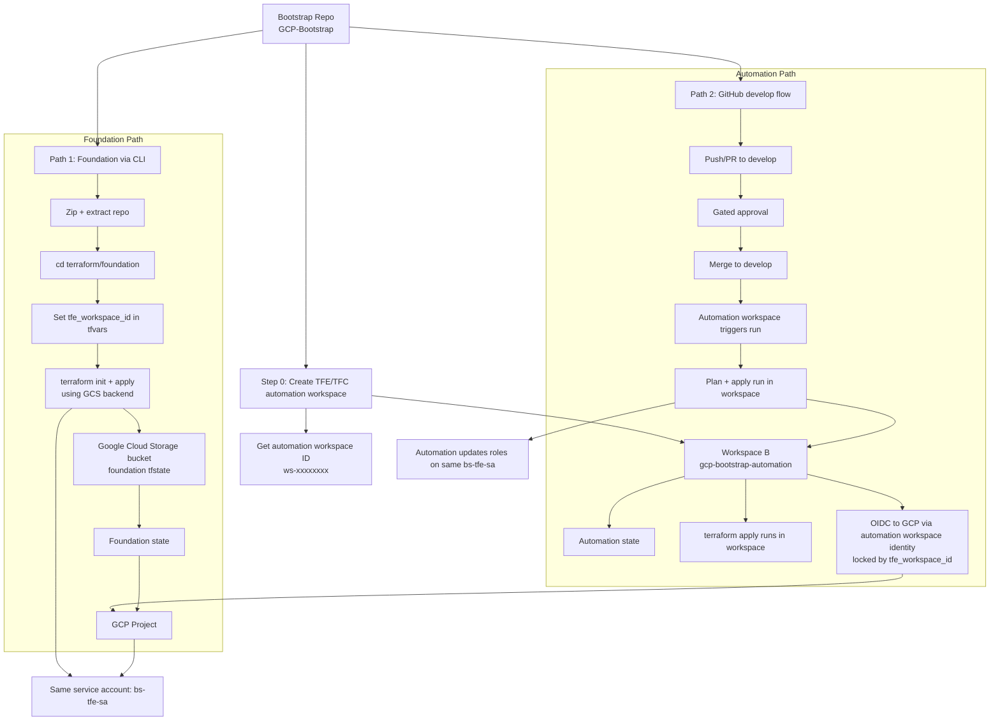

# GCP Bootstrap Flow



## Notes

- Create automation workspace first; foundation needs the automation `tfe_workspace_id`.
- Foundation state is stored in GCS object storage; automation state is stored in TFE workspace backend.
- For the GitHub-driven path, `terraform apply` runs in the Terraform workspace, not on the GitHub runner.
- Path 2 uses develop branch flow: push/PR -> gated approval -> merge to develop -> workspace-triggered run.
- OIDC to GCP for Path 2 happens via automation workspace identity.
- Foundation stack creates trust + service account.
- Automation stack manages role updates for the same `bs-tfe-sa`.
- Destroy uses the same backend where state lives (foundation destroy via CLI + GCS state, automation destroy via TFE workspace state).

## Foundation Steps (No Diagram)

### 1) Why this two-step flow

Use this when all are true:

- no TFE auth from local
- do not want to manually create project first
- do not want to keep state in Git

### 2) Prerequisites

- Have automation workspace ID ready (`ws-xxxxxxxxxxxxxxxx`)
- Authenticate locally to GCP:
  - `gcloud auth login`
  - `gcloud auth application-default login`
  - `gcloud config set project <SEED_ORG_ACCESS_PROJECT>`

### 3) First foundation run (temporary local state)

```bash
cd terraform/foundation
cp terraform.tfvars.example terraform.tfvars
```

Edit `terraform.tfvars`:

- `project_id = "<BOOTSTRAP_PROJECT_ID>"`
- `create_project = true`
- one of:
  - `org_id = "<ORG_ID>"`, or
  - `folder_id = "<FOLDER_ID>"`
- `billing_account = "<BILLING_ACCOUNT_ID>"`
- `tfe_workspace_id = "ws-xxxxxxxxxxxxxxxx"`
- `create_state_bucket = true`
- optional override:
  - `foundation_state_bucket_name = "<GLOBAL_UNIQUE_BUCKET_NAME>"`

Run locally (no backend config yet):

```bash
terraform init
terraform plan
terraform apply
```

This run creates:

- bootstrap project (if `create_project=true`)
- foundation resources (`bs-tfe-sa`, WIF, IAM)
- state bucket (if `create_state_bucket=true`)

### 4) Configure remote backend to GCS

```bash
cp backend.hcl.example backend.hcl
```

Edit `backend.hcl`:

- `bucket = "<foundation_state_bucket_name or created bucket>"`
  - `prefix = "gcp-bootstrap/foundation"`

### 5) Migrate local state to GCS backend

```bash
terraform state pull > foundation-state-backup.tfstate
terraform init -migrate-state -backend-config=backend.hcl
```

### 6) Verify

- Confirm state objects exist in GCS bucket under prefix.
- Confirm outputs include:
  - bootstrap service account email
  - workload identity provider name

### Best Practices

- Keep remote state in GCS after migration; do not keep active state local.
- Never commit `.tfstate` to Git.
- Keep bucket versioning enabled.
- Restrict state bucket IAM to least privilege.
- Keep foundation and automation states separate.
- Teardown order: destroy automation first, foundation second.

## Local State -> GCS Migration and Destroy Runbook

### A) Migrate local state to GCS object storage

Run from `terraform/foundation` after first successful local apply:

```bash
cd terraform/foundation
cp backend.hcl.example backend.hcl
```

Edit `backend.hcl` with the created bucket:

```hcl
bucket = "<FOUNDATION_STATE_BUCKET_NAME>"
prefix = "gcp-bootstrap/foundation"
```

Take a backup of current local state:

```bash
terraform state pull > foundation-state-backup.tfstate
```

Migrate to GCS backend:

```bash
terraform init -migrate-state -backend-config=backend.hcl
```

Validate migration:

```bash
terraform state list
```

And verify objects in bucket prefix from GCP Console or CLI.

### B) Later destroy by pointing Terraform to same backend

When you want to destroy foundation resources later, always reuse the same `backend.hcl` (same bucket + prefix).

```bash
cd terraform/foundation
terraform init -backend-config=backend.hcl
terraform plan -destroy
terraform destroy
```

Important:

- If backend bucket/prefix changes, Terraform will not find the original state.
- Keep `backend.hcl` safe (do not commit it).
- Ensure you are using the same `terraform.tfvars` context used for creation.
