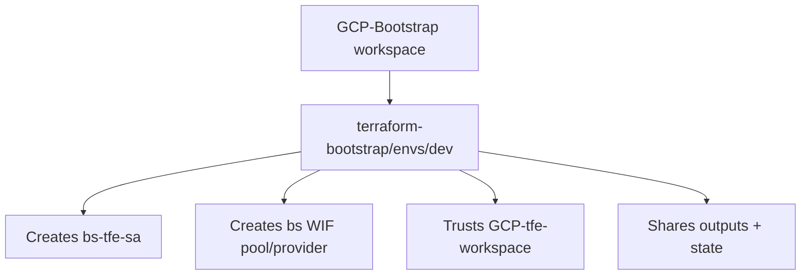
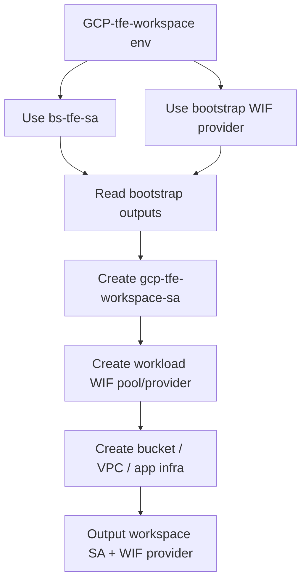
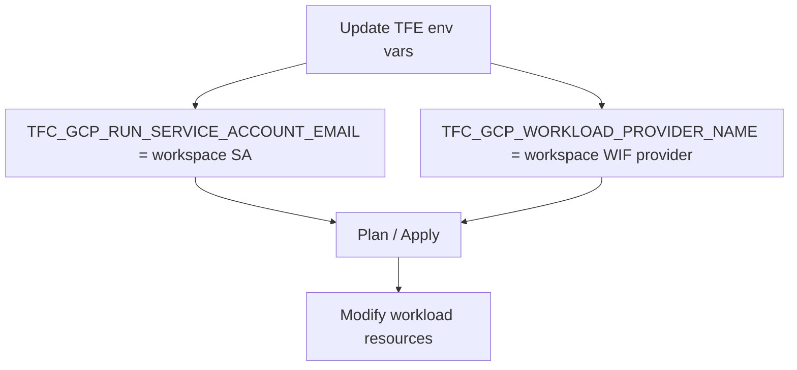
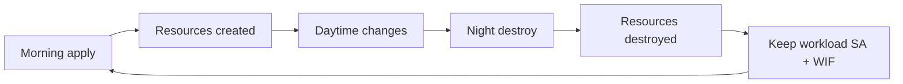

# Daily Workload Workspace Flow

This flow shows the handoff model where the first workload run uses the bootstrap service account, then the workload workspace creates its own service account and uses that identity for later runs.

---

## High-Level Goal

The goal is to support a daily destroy/recreate workflow without destroying the bootstrap identity path.

There are two identity phases:

- **Bootstrap identity phase:** `GCP-tfe-workspace` uses `bs-tfe-sa` and the bootstrap WIF provider for the first run.
- **Workload identity phase:** `GCP-tfe-workspace` switches to its own service account and its own WIF provider for later runs.

Terraform cannot automatically switch identities inside one run because TFE injects `TFC_GCP_*` environment variables before Terraform starts. The handoff therefore happens between runs.

---

## Diagram 1 — Bootstrap (persistent)

---

## Diagram 2 — First run (uses bootstrap SA)

---

## Diagram 3 — Later runs (uses own SA)

---

## Diagram 4 — Daily lifecycle

---

## Key Rule

`GCP-tfe-workspace` can use `bs-tfe-sa` for the first run, create its own workload service account, and then use the workload service account for later runs.

---

## First Run Setup

In `GCP-tfe-workspace`, use bootstrap identity values:

<pre style="font-size: 20px;">
TFC_GCP_PROVIDER_AUTH=true
TFC_GCP_PRINCIPAL_TYPE=service_account
TFC_GCP_WORKLOAD_PROVIDER_NAME=&lt;GCP-Bootstrap output tfe_workload_identity_provider&gt;
TFC_GCP_RUN_SERVICE_ACCOUNT_EMAIL=&lt;GCP-Bootstrap output bootstrap_service_account_email&gt;
</pre>

The first run creates:

- workload service account, for example `gcp-tfe-workspace-sa`
- workload WIF pool/provider, for example `tfe-workspace-pool` / `tfe-workspace-provider`
- impersonation binding for workspace `ws-2UNjJ7BXhV5ZnrAG`
- workload resources such as buckets, VPCs, and application infrastructure

The first run outputs:

<pre style="font-size: 20px;">
workspace_service_account_email
workspace_workload_identity_provider
</pre>

---

## Handoff After First Run

After the first successful apply, update the `GCP-tfe-workspace` environment variables:

<pre style="font-size: 20px;">
TFC_GCP_WORKLOAD_PROVIDER_NAME=&lt;workspace output workspace_workload_identity_provider&gt;
TFC_GCP_RUN_SERVICE_ACCOUNT_EMAIL=&lt;workspace output workspace_service_account_email&gt;
</pre>

Keep these unchanged:

<pre style="font-size: 20px;">
TFC_GCP_PROVIDER_AUTH=true
TFC_GCP_PRINCIPAL_TYPE=service_account
</pre>

After this handoff, normal plans and applies use the workload workspace identity, not `bs-tfe-sa`.

---

## Daily Destroy And Rebuild

Daily destroy should remove only workload resources that are safe to recreate.

**Destroy order (Terraform):** all workload modules (buckets, VPC, apps) first → WIF impersonation → WIF provider → WIF pool → project IAM → **workload SA last**. The workload SA stays valid through the run and deletes itself at the end.

**Before destroy:** env vars must match state outputs (`TFC_GCP_*` for the current suffix). The destroy script syncs workload auth automatically; for TFE UI destroy, run **TFE Sync Workload Auth** first.

**After destroy:** run **TFE Switch Bootstrap Auth** then **TFE Copy Bootstrap Auth** (bumps `resource_suffix` when state is empty).

**Adding new resources:** add them in `modules/workload-resources/` only. Do not add sibling modules to `workload-stack/` — that file has the single `depends_on` that protects destroy order.

**Safe to destroy daily:**

- buckets used only for test/demo workload data
- VPC/subnets/firewalls for ephemeral environments
- application infrastructure

**Do not destroy** unless you intentionally want to repeat the bootstrap-identity handoff:

- `gcp-tfe-workspace-sa`
- `tfe-workspace-pool`
- `tfe-workspace-provider`
- impersonation binding for the TFE workspace

If those identity resources are destroyed, the next run cannot authenticate with the workload identity. Switch the TFE environment variables back to bootstrap values and run the first-run flow again.

---

## GCS Bucket vs Service Account (Name Reuse After Delete)

Destroy behavior differs by resource type. Do not assume bucket timing applies to service accounts or WIF pools.

| | GCS bucket | Service account | WIF pool / provider |
|--|------------|-----------------|---------------------|
| Soft-delete window | 7 days (default) | 30 days | ~30 days |
| Same name after delete | Usually **seconds** | **Blocked** while soft-deleted (409) | **Blocked** while soft-deleted (409) |
| Hard purge | After retention | After 30 days | After soft-delete retention |
| Same name = same identity? | No (new bucket) | No if recreated (new unique ID); **yes** if undeleted within 30 days | No if recreated; undelete if still in window |

**GCS bucket notes:**

- Soft delete keeps a recoverable copy for up to 7 days, but the **name** is usually free again in seconds.
- `force_destroy = true` in Terraform only empties the bucket so destroy can succeed. It does **not** disable soft delete or force immediate hard delete.

**Service account notes:**

- Reusing `account_id` (for example `gcp-tfe-workspace-sa-4`) right after destroy typically returns `409 Already exists`.
- Options: **do not destroy** the SA, **undelete** within 30 days, or **rotate a suffix** (`-4`, `-5`, …) in Terraform.

**Practical dev rule:** destroy buckets freely; keep workload SA + WIF pool across daily cycles, or bump the suffix after a full identity destroy.

After destroy, run the **TFE Copy Bootstrap Auth** GitHub Actions workflow — it resets bootstrap auth env vars and auto-increments `resource_suffix` in `tfe-workspace/envs/dev/main.tf` (+1 per run).

---

## Important Limitation

- TFE chooses `TFC_GCP_RUN_SERVICE_ACCOUNT_EMAIL` before Terraform starts.
- Terraform cannot automatically switch from `bs-tfe-sa` to the workload service account inside the same run.
- After the first run creates the workload service account, update the TFE workspace environment variable to use that workload service account for later runs.

---

## Failure Modes

**WIF rejected:**

<pre style="font-size: 20px;">
The given credential is rejected by the attribute condition
</pre>

The WIF provider being used does not trust the current TFE workspace ID.

**Remote state forbidden:**

<pre style="font-size: 20px;">
Error retrieving state: forbidden
</pre>

`GCP-Bootstrap` has not shared remote state with `GCP-tfe-workspace`.

**After destroy:**

If later runs fail after a destroy, check whether the workload service account or workload WIF provider was destroyed. If yes, switch back to bootstrap identity for one run and recreate the workload identity.

