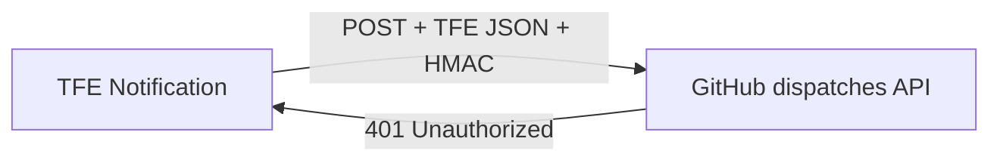
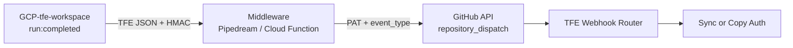

# Why TFE Notifications Cannot Call GitHub Actions Directly

TFE notifications and GitHub Actions are two different systems with different rules. They do not speak the same language, so you cannot wire them together with only a Webhook URL in TFE.

---

## 1. TFE only gives you URL + Token

In **GCP-tfe-workspace → Settings → Notifications**, TFE lets you configure:

| Field | Purpose |
|-------|---------|
| **Webhook URL** | Any HTTPS endpoint |
| **Token** | Signs the request (HMAC) — not for calling other APIs |
| **Event** | e.g. `run:completed` |

When a run finishes, TFE **POSTs its own JSON**, for example:

```json
{
  "run_id": "run-xxxxx",
  "workspace_name": "GCP-tfe-workspace",
  "notifications": ["run:completed"]
}
```

You **cannot** configure:

- A GitHub Personal Access Token (PAT)
- A custom body like `{"event_type":"tfe-workload-applied"}`
- GitHub headers like `Authorization: Bearer ...`

---

## 2. GitHub Actions do not accept arbitrary webhooks

GitHub Actions start from **GitHub events** — push, schedule, `workflow_dispatch`, `repository_dispatch`, etc.

There is **no** “accept any HTTP POST and start a workflow” endpoint.

To trigger a workflow from **outside** GitHub, you must call the **GitHub REST API**:

```http
POST https://api.github.com/repos/UttamGiri/GCP-Bootstrap/dispatches
Authorization: Bearer <GITHUB_PAT>
Accept: application/vnd.github+json
Content-Type: application/json

{
  "event_type": "tfe-workload-applied",
  "client_payload": { "run_id": "run-xxxxx" }
}
```

That requires:

| Requirement | TFE provides? |
|-------------|---------------|
| GitHub API URL | You can paste it, but… |
| `Authorization: Bearer <PAT>` | **No** |
| `event_type` JSON body | **No** |

---

## 3. The Token field is not a GitHub token

A common mistake is putting the GitHub API URL in **Webhook URL** and expecting **Token** to be the PAT. It is not.

| TFE Token | GitHub PAT |
|-----------|------------|
| Signs the webhook (`X-TFE-Notification-Signature`) | Authenticates to GitHub API |
| Proves “TFE sent this” | Proves “I may trigger Actions” |
| Never sent as `Authorization: Bearer` | Required on every API call |

GitHub never sees a valid PAT → **401 Unauthorized** (what you saw on notification verify).

---

## 4. Different payloads

Even if auth were fixed, the **body** would not match.

| TFE sends | GitHub expects |
|-----------|----------------|
| `run_id`, `run_url`, `workspace_name` | `event_type`, `client_payload` |
| “A TFE run completed” | “Start this workflow with this payload” |

GitHub would not know which workflow to run.

---

## Visual summary

```text
TFE Notification                    GitHub Actions
─────────────────                   ────────────────
POST to any URL          ≠          Must use GitHub API
TFE JSON payload         ≠          repository_dispatch JSON
HMAC Token               ≠          Bearer PAT
run:completed event      →          needs translation → event_type
```

```text
TFE ──POST──► GitHub API URL
              │
              └── 401: wrong auth, wrong body
```



---

## What works instead

### Option A — Middleware (automatic)

A small bridge service receives TFE’s webhook and calls GitHub’s API.



**Middleware logic:**

```text
ON POST from TFE:
  IF signature invalid → return 401
  IF no run_id → return 200 (TFE verification ping)

  run = TFE_API.get_run(run_id)
  IF run.status NOT IN (applied, planned_and_finished) → return 200 skip
  IF run.is_destroy → event_type = "tfe-workload-destroyed"
  ELSE               → event_type = "tfe-workload-applied"

  GitHub_API.post("/repos/UttamGiri/GCP-Bootstrap/dispatches", {
    event_type: event_type,
    client_payload: { run_id: run_id }
  }, headers: { Authorization: "Bearer " + GITHUB_PAT })

  return 200
```

**TFE notification (with middleware):**

| Field | Value |
|-------|--------|
| Webhook URL | Middleware URL — **not** the GitHub API URL |
| Token | Shared secret for HMAC (same on middleware) |
| Triggers | **Completed** only |

**Secrets on middleware (never in TFE):**

| Secret | Purpose |
|--------|---------|
| `TFE_WEBHOOK_SECRET` | Verify TFE HMAC |
| `TFE_TOKEN` | Read run status / apply vs destroy |
| `GITHUB_PAT` | Call GitHub `repository_dispatch` |

**GitHub repo secret:**

| Secret | Purpose |
|--------|---------|
| `TFE_TOKEN` | Sync/copy workflows update workspace env vars |

Third-party options: Pipedream, GCP Cloud Function, AWS Lambda — all use the same pattern.

---

### Option B — Manual (no middleware)

Disable or delete the TFE notification (or set **No events**). After each successful run:

**GitHub → Actions → TFE Webhook Router → Run workflow**

| After… | Select event |
|--------|----------------|
| Apply succeeded | `tfe-workload-applied` |
| Destroy succeeded | `tfe-workload-destroyed` |

Or run **TFE Sync Workload Auth** / **TFE Copy Bootstrap Auth** directly.

---

## Cheat sheet

| Do | Don't |
|----|--------|
| Put **middleware URL** in TFE Webhook URL | Put GitHub API URL in TFE Webhook URL |
| Store **GitHub PAT** on middleware only | Put GitHub PAT in TFE Token field |
| Use TFE Token as **HMAC shared secret** | Expect TFE Token to authenticate to GitHub |
| Trigger **Completed** only | Enable all run events unless needed |
| Set GitHub secret **`TFE_TOKEN`** for sync workflows | Rely on webhook alone without GitHub `TFE_TOKEN` |

---

## One-line summary

**TFE notifications push “run finished” to a URL; GitHub Actions only start via GitHub’s API with a PAT and a specific JSON shape — TFE cannot send either, so direct wiring always fails.**

Use **middleware** for automatic sync, or **TFE Webhook Router** manually after each run.
