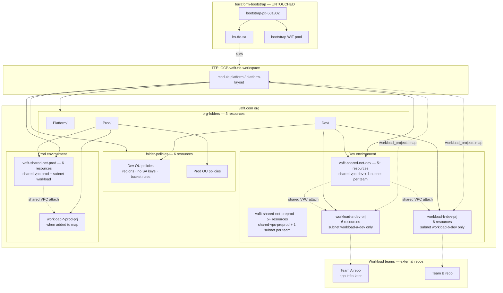

# GCP Platform Architecture

Platform team provisions landing zones for **vaflt.com** (org `327947404107`).  
Workload teams own **separate repos** — not documented here except handoff outputs.

**Bootstrap** (`terraform-bootstrap/`) is untouched — bootstrap project + `bs-tfe-sa` only.

---

## 1. Platform scope — what platform creates

```text
TFE: GCP-vaflt-tfe-workspace  →  tfe-workspace/envs/dev
Auth: bs-tfe-sa (bootstrap SA)

module.platform (platform-layout/)
│
├── org-folders
│     ├── Platform/
│     ├── Dev/
│     └── Prod/
│
├── folder-policies (per Dev, Prod OU)
│     ├── gcp.resourceLocations          → allowed regions only
│     ├── iam.disableServiceAccountKeyCreation  → no JSON keys
│     └── storage.uniformBucketLevelAccess      → bucket rules
│
├── shared-network (per environment: dev, prod)
│     ├── host project (e.g. vaflt-shared-net-dev)
│     ├── shared VPC + subnets
│     └── workload teams attach as service projects
│
└── workload-project (for_each team in map)
      ├── google_project              → under Dev/ or Prod/ folder
      ├── shared VPC service attach   → uses env shared network
      ├── subnet IAM networkUser      → per team subnet only (serviceProject binding)
      └── workspace-identity          → COMMENTED OUT (SA + WIF per team)
```

---

## 2. Resource count (current code)

**Today:** `workload-a-dev` + `workload-b-dev` in map; **SA + WIF commented out**; subnet `networkUser` per service project is **enabled**.

### First platform apply — **25 resources**

| Module | Resources | Count |
|--------|-----------|------:|
| **org-folders** | `google_folder` (Platform, Dev, Prod) | **3** |
| **folder-policies** | `google_org_policy_policy` × 3 on Dev + Prod | **6** |
| **shared-network (dev)** | project, 2 APIs, shared VPC host, VPC (subnets per team when added) | **5** |
| **shared-network (preprod)** | same | **5** |
| **shared-network (prod)** | project, 2 APIs, shared VPC host, VPC, 1 subnet | **6** |
| **workload-project** | none (map empty) | **0** |
| | **Total** | **25** |

**GCP projects created:** 3 (`vaflt-shared-net-dev`, `vaflt-shared-net-preprod`, `vaflt-shared-net-prod`)  
**Bootstrap project:** not touched

### If you add teams (SA/WIF still commented)

**Per lower-env team ≈ 6 resources** (+ **1 GCP project**): dedicated subnet + service project attach + subnet IAM.

| Per lower-env team | Count |
|--------------------|------:|
| `google_compute_subnetwork` (team subnet in host VPC) | 1 |
| `google_project` | 1 |
| `google_project_service` (CRM + compute) | 2 |
| `google_compute_shared_vpc_service_project` | 1 |
| `google_compute_subnetwork_iam_member` (networkUser on team subnet only) | 1 |
| **Subtotal per lower-env team** | **6** |

**Per prod team ≈ 4 resources** (uses shared `workload` subnet on prod VPC).

| Scenario | ~Terraform resources | GCP projects |
|----------|---------------------:|-------------:|
| First apply only | **25** | 3 |
| + 1 dev team | **31** | 4 |
| + 2 dev teams (workload-a + workload-b) | **37** | 5 |
| + 1 dev + 1 preprod team | **37** | 5 |

When **`module.identity` is uncommented**, add **~11 resources per team** (SA, WIF pool/provider, IAM, subnet binding).

### First apply tree

```text
FIRST APPLY = 25 resources
│
├── Platform/     (folder)
├── Dev/          (folder) + 3 org policies
├── Prod/         (folder) + 3 org policies
│
├── vaflt-shared-net-dev/     (5 resources)
│     shared-vpc-dev (subnets added per team)
│
├── vaflt-shared-net-preprod/ (5 resources)
│     shared-vpc-preprod (subnets added per team)
│
└── vaflt-shared-net-prod/    (6 resources)
      shared-vpc-prod + subnet workload

(workload team projects: none until map populated)
(team SA + WIF: commented out in workload-project/main.tf)
```

---

## 3. Architecture diagram



---

## 4. What platform does NOT create

| Not in platform repo | Owner |
|----------------------|--------|
| Buckets, GKE, Cloud Run, VMs | Workload team repos |
| Team VPCs | Platform shared VPC only |
| Bootstrap project resources | `terraform-bootstrap/` |
| Application IAM beyond team SA baseline | Workload team repos |

---

## 5. GCP layout after apply

```text
vaflt.com
│
├── Platform/
│
├── Dev/
│     ├── vaflt-shared-net-dev/          ← shared VPC host (platform)
│     │     network: shared-vpc-dev
│     │     subnet: workload-a-dev (10.10.0.0/24)
│     │     subnet: workload-b-dev (10.10.1.0/24)
│     │
│     ├── vaflt-shared-net-preprod/      ← shared VPC host (platform)
│     │     network: shared-vpc-preprod
│     │     subnet: workload-a-preprod (10.11.0.0/24)
│     │
│     ├── workload-a-dev-prj/            ← service project (platform)
│     │     SA + WIF commented out
│     │
│     └── workload-b-dev-prj/
│           SA + WIF commented out
│
├── Prod/
│     ├── vaflt-shared-net-prod/         ← shared VPC host
│     └── workload-*-prod-prj/           ← service projects
│
└── bootstrap-prj-501802                 ← UNTOUCHED (terraform-bootstrap)
      bs-tfe-sa + bootstrap WIF
```

---

## 6. OU policies — allowed vs not allowed

Applied at **Dev** and **Prod** folder level (`folder-policies/`):

| Policy | Allowed | Blocked / enforced |
|--------|---------|-------------------|
| **Regions** | US (`in:us-locations` default) | Resources in other regions |
| **SA keys** | WIF only | Downloadable JSON keys |
| **Buckets** | Uniform bucket-level access | Legacy ACL-only buckets |

Platform defines guardrails. Workload teams deploy **inside** these rules in their repos.

---

## 7. Shared VPC per environment

```text
DEV / PREPROD (lower envs)              PROD
────────────────────────────            ────
vaflt-shared-net-dev                    vaflt-shared-net-prod
  shared-vpc-dev                            shared-vpc-prod
  subnet: workload-a-dev (per team)         subnet: workload (shared)
  subnet: workload-b-dev                         ▲
       ▲                                         │ attach
       │ attach                                  │
       │                                         │
workload-a-dev-prj                       workload-a-prod-prj
workload-b-dev-prj                       workload-b-prod-prj

vaflt-shared-net-preprod
  shared-vpc-preprod
  subnet: workload-a-preprod (per team)
       ▲
       │ attach
workload-a-preprod-prj
```

- One **host project** + **VPC** per environment (platform creates).  
- **Lower envs (dev, preprod):** one **subnet per team** — subnet name = `workload_projects` map key; set `subnet_cidr` per team.  
- **Prod:** shared `workload` subnet for now (override with `shared_subnet_names` if needed).  
- Team projects are **service projects** — they do not create VPCs.  
- Subnet isolation: `networkUser` on **each team's subnet only** via `serviceProject:PROJECT_ID` (project A cannot use project B's subnet).
- Team SA + WIF — **commented out** until each team has its own TFE workspace.

---

## 8. Onboard a team (`workload_projects` map)

```text
envs/dev/main.tf
  workload_projects = {
    workload-a-dev = {
      folder_key         = "dev"
      shared_network_key = "dev"
      project_id         = "workload-a-dev-prj"
      project_name       = "Workload A Dev"
      tfe_workspace_id   = "ws-TEAM-A"
      service_account_id = "tfe-workload-a-dev-sa"
      subnet_cidr        = "10.10.0.0/24"   # required for dev/preprod — creates subnet workload-a-dev
    }
  }
```

**Platform creates today:** project + shared VPC attach.  
**Commented out:** team SA + WIF (`module.identity` in `workload-project/main.tf`).  
**Handoff to team:** `project_id` (+ SA/WIF outputs when enabled).

---

## 9. Module reference (platform only)

```text
MODULE             │ ROLE
───────────────────┼────────────────────────────────────────────
platform-layout    │ Orchestrator — wires everything below
org-folders        │ Platform, Dev, Prod OUs
folder-policies    │ OU constraints on Dev/Prod
shared-network     │ Shared VPC host project per env
workload-project   │ Team project + shared VPC attach (SA/WIF commented)
workspace-identity │ SA + WIF building block (nested, disabled)
```

---

## 10. Authentication phases

```text
PHASE 0  terraform-bootstrap     → bootstrap-prj + bs-tfe-sa
PHASE 1  platform TFE apply       → folders, policies, shared VPC, team projects
PHASE 2  team TFE (external repo) → app infra in team project (SA/WIF when enabled)
```

---

## 11. Bootstrap SA permissions (one-time)

```text
roles/resourcemanager.folderAdmin      → folders
roles/resourcemanager.projectCreator   → projects
roles/billing.user                     → billing
roles/orgpolicy.policyAdmin            → OU policies (or folder admin)
roles/compute.xpnAdmin                 → shared VPC (optional)
```

---

## Related docs

- [BOOTSTRAP-FLOW.md](BOOTSTRAP-FLOW.md)
- [tfe-workspace/README.md](../tfe-workspace/README.md)
