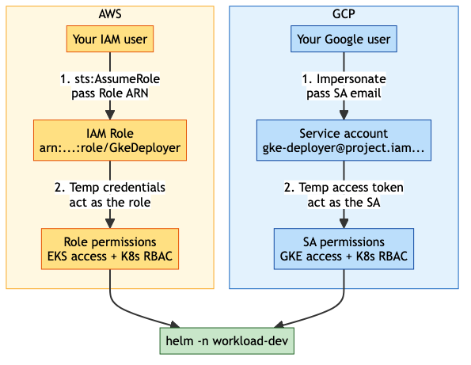
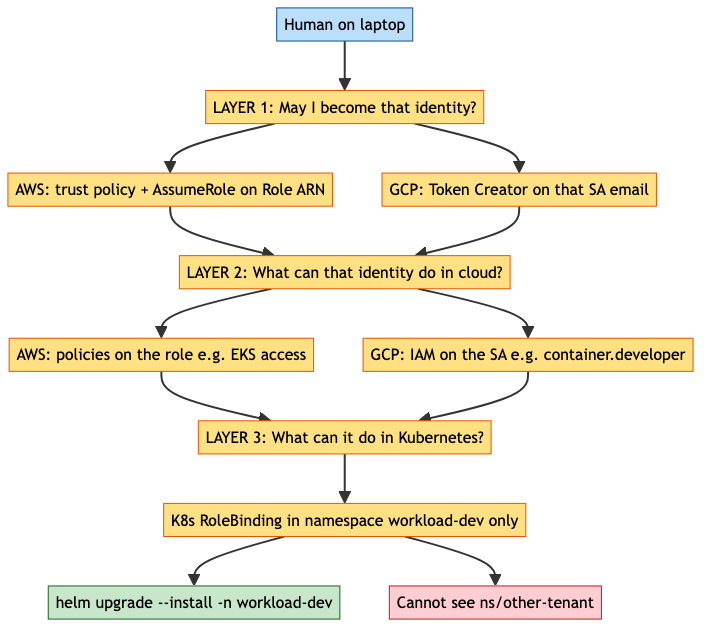
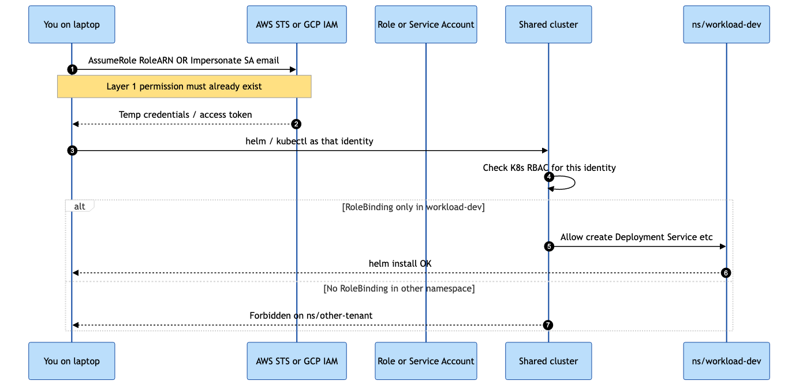
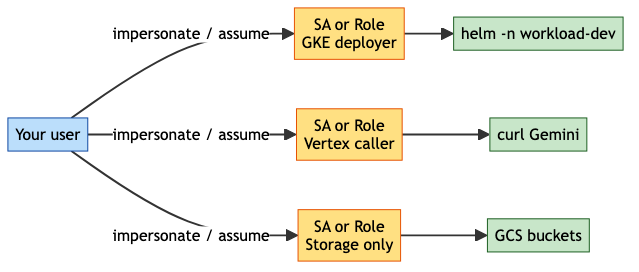
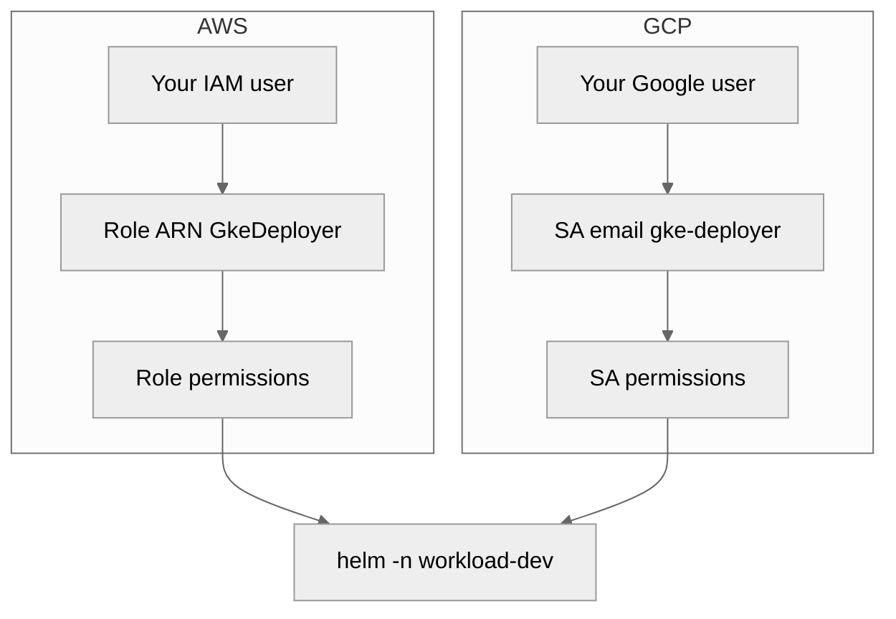

# AWS AssumeRole vs GCP impersonation (Helm example)

Clear comparison using **Kubernetes namespace + helm deploy** as the example.

Diagrams are light PNGs (GitHub-safe). Mermaid source at the bottom.

---

## One-sentence version

**AWS Role ARN** ≈ **GCP service account email**.  
You must be allowed to **assume / impersonate** that identity, then that identity’s
permissions (plus Kubernetes RBAC) decide if `helm -n workload-dev` works.

---

## Side by side



| Step | AWS | GCP |
|---|---|---|
| You are | IAM user / role | Google user |
| You name the target | **Role ARN** | **Service account email** |
| Permission to become it | Trust policy + `sts:AssumeRole` | `roles/iam.serviceAccountTokenCreator` on that SA |
| You receive | Temp access key / session | Temp **access token** |
| Cloud API rights | Policies **on the role** | IAM roles **on the SA** |
| K8s rights | RBAC for that role’s mapped identity | RBAC for that SA |

---

## Three layers (this is what people miss)



To run:

```bash
helm upgrade --install myapp ./chart -n workload-dev
```

all three layers must pass:

### Layer 1 — May I become that identity?

| AWS | GCP |
|---|---|
| Your user is trusted to assume `arn:...:role/GkeDeployer` | Your user has **Token Creator** on `gke-deployer@...` |

Without this: AssumeRole / impersonation **fails**. You never get temp creds.

### Layer 2 — What can that identity do in the cloud?

| AWS | GCP |
|---|---|
| Role can call EKS / get kubeconfig | SA has GKE IAM (e.g. cluster access) |

Without this: you have a token/creds but **cannot talk to the cluster API**.

### Layer 3 — What can it do inside Kubernetes?

| Both clouds |
|---|
| RoleBinding (or equivalent) **only** in namespace `workload-dev` |

Without this: you reach the cluster but `helm -n workload-dev` is **Forbidden**,  
and you still **cannot see** `other-tenant`.

### Where this lives in Terraform (this repo)

| Layer | Resource | File |
|---|---|---|
| 1 — Impersonate allowlist | `google_service_account_iam_member.token_creator` on `gke-deployer` (`roles/iam.serviceAccountTokenCreator` for each `impersonators` member) | `tfe-workspace/modules/workload-project/main.tf` |
| 1 — Allowlist value | `workload_dev.impersonators` (e.g. `["user:you@vaflt.com"]`; `[]` = nobody) | `tfe-workspace/envs/dev/main.tf` |
| 2 — GKE API | `google_project_iam_member.deployer_container_developer` (`roles/container.developer` on the SA) | `tfe-workspace/modules/shared-gke/main.tf` |
| 3 — Namespace only | `kubernetes_role_v1.tenant_edit` + `kubernetes_role_binding_v1.tenant_deployer` (subject = deployer SA email) | `tfe-workspace/modules/shared-gke/main.tf` |

Users never get `container.developer` directly. Only listed impersonators can mint
tokens as the SA; the SA alone has cluster + namespace rights.

Full walkthrough: [Design: workload-dev + shared GKE](DESIGN-WORKLOAD-DEV-GKE.md#impersonation-in-this-repo-who-can-do-what).

---

## Sequence: helm into one namespace



```text
You
  → assume Role ARN  OR  impersonate SA email     (Layer 1)
  → temp credentials / token
  → kubectl / helm as that identity               (Layer 2)
  → K8s checks RoleBinding in ns/workload-dev     (Layer 3)
  → helm install OK
  → other namespaces: denied
```

---

## Different jobs = different identities (like different Role ARNs)



| Job | AWS | GCP |
|---|---|---|
| Helm into `workload-dev` | `role/GkeDeployer` | `gke-deployer@workload-dev...` |
| Call Gemini | `role/VertexCaller` | `vertex-psc-client-1@bootstrap...` |
| Read GCS only | `role/StorageReader` | `storage-reader@...` |

Your user can be allowed to assume/impersonate **several** targets.  
Each target has **different** permissions — that is how you separate access.

### Commands (same idea)

```bash
# --- AWS ---
aws sts assume-role \
  --role-arn arn:aws:iam::123456789012:role/GkeDeployer \
  --role-session-name helm-dev
# then helm -n workload-dev

# --- GCP ---
gcloud config set auth/impersonate_service_account \
  gke-deployer@WORKLOAD_DEV_PROJECT.iam.gserviceaccount.com
gcloud container clusters get-credentials SHARED_GKE --region us-central1 --project HOST_PROJECT
helm upgrade --install myapp ./chart -n workload-dev
gcloud config unset auth/impersonate_service_account
```

Or one-shot token (GCP):

```bash
TOKEN=$(gcloud auth print-access-token \
  --impersonate-service-account=gke-deployer@WORKLOAD_DEV_PROJECT.iam.gserviceaccount.com)
```

---

## Concrete Helm story (GCP)

1. Platform creates SA `gke-deployer@workload-dev...`
2. Grants your user **Token Creator** on that SA (Layer 1)
3. Grants that SA GKE access on the shared cluster (Layer 2)
4. Creates K8s RoleBinding: SA → `edit` **only** in `namespace/workload-dev` (Layer 3)
5. You impersonate that SA and run helm
6. You cannot list pods in `other-tenant` — no RoleBinding there

Same story on AWS with Role ARN + EKS access entry / aws-auth + RoleBinding.

---

## Cheat sheet

| Question | Answer |
|---|---|
| Is impersonation like AssumeRole? | **Yes** |
| What do I pass instead of Role ARN? | **Service account email** |
| Does my user need deploy rights directly? | **No** — only permission to impersonate/assume the deployer identity |
| What stops me seeing other namespaces? | **Kubernetes RBAC** (Layer 3), not AssumeRole/impersonation alone |
| One identity for everything? | **No** — use different roles/SAs per job |

---

## Mermaid source



**Not pushed** — local only until you ask.
