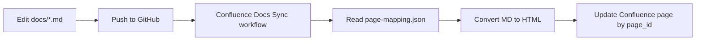

# Confluence docs sync

Markdown under `docs/` can be published to Confluence automatically via GitHub Actions. Edit locally in git; Confluence receives updates on push or manual run.

## How it works 



| Component | Path |
|-----------|------|
| Workflow | `.github/workflows/confluence-docs-sync.yml` |
| Sync script | `.github/scripts/sync-confluence.py` |
| Page mapping | `docs/confluence/page-mapping.json` |

The sync **updates page body only**. It does not create pages or change titles (Confluence requires unique titles per space).

---

## One-time setup

### 1. Create Confluence pages (manual)

For each markdown file you want in Confluence:

1. In Confluence, create an empty page with a **unique title** in that space.
2. Copy the **page ID** from the URL:  
   `https://vaflt.atlassian.net/wiki/spaces/.../pages/786524/Title` → `786524`
3. Add the ID to `docs/confluence/page-mapping.json`.

**Current dev pages (vaflt personal space):**

| Markdown file | Page ID | Confluence page |
|---------------|---------|-----------------|
| `README.md` | `753666` | [GCP Bootstrap Documentation. 2](https://vaflt.atlassian.net/wiki/spaces/~62a910ec6085950068ae2442/pages/753666/GCP+Bootstrap+Documentation.+2) |
| `BOOTSTRAP-FLOW.md` | `786524` | [GCP Bootstrap Flow](https://vaflt.atlassian.net/wiki/spaces/~62a910ec6085950068ae2442/pages/786524/GCP+Bootstrap+Flow) |

**Suggested unique titles** when creating new pages:

| Markdown file | Example title |
|---------------|---------------|
| `DAILY-WORKSPACE-FLOW.md` | GCP Bootstrap — Daily Workspace Flow |
| `TFE-WEBHOOK-GITHUB.md` | GCP Bootstrap — TFE Webhook and GitHub |
| `CONFLUENCE-DOCS-SYNC.md` | GCP Bootstrap — Confluence Docs Sync |

If you see *"Page names have to be unique within a space"*, pick a different title or rename the existing page.

### 2. Configure page mapping

Keys are **filenames** under `docs/` (not paths). Only `page_id` is required.

```json
{
  "dev": {
    "README.md": { "page_id": "753666" },
    "BOOTSTRAP-FLOW.md": { "page_id": "786524" },
    "CONFLUENCE-DOCS-SYNC.md": { "page_id": "REPLACE_WITH_PAGE_ID" }
  }
}
```

All syncs use the **`dev`** section only (including pushes to `main`). Add a `prod` section later when you have separate production Confluence pages.

### 3. Add GitHub secret (API token)

Only **one** repository secret is required:

| Secret | Required | Notes |
|--------|----------|-------|
| `CONFLUENCE_API_TOKEN` | **Yes** | [Create at Atlassian](https://id.atlassian.com/manage-profile/security/api-tokens) |

**Steps:**

1. Log in to Atlassian with the account that owns/edits the Confluence pages.
2. Open [API tokens](https://id.atlassian.com/manage-profile/security/api-tokens) → **Create API token** → copy it.
3. GitHub repo → **Settings** → **Secrets and variables** → **Actions** → **New repository secret**.
4. Name: `CONFLUENCE_API_TOKEN`, value: paste token.

**Defaults** (already set in the workflow — no secrets needed):

| Setting | Default |
|---------|---------|
| `CONFLUENCE_BASE_URL` | `https://vaflt.atlassian.net` |
| `CONFLUENCE_EMAIL` | `uttamgiri32@vaflt.com` |

To change site or account, edit `env` in `.github/workflows/confluence-docs-sync.yml`.

---

## Running the sync

### Automatic

Every push to `main` or `develop` that touches `docs/**` syncs **all mapped** markdown files to Confluence (not just changed files).

| Trigger | What syncs |
|---------|------------|
| Push to `main` or `develop` | All files in `page-mapping.json` → `dev` |
| Manual workflow run | All mapped files |

### Local test (optional)

```bash
export CONFLUENCE_API_TOKEN="your-token"
python3 .github/scripts/sync-confluence.py --env dev --files BOOTSTRAP-FLOW.md
```

---

## Adding a new document

1. Add `docs/MY-NEW-DOC.md`.
2. Create a Confluence page (unique title) and copy its page ID.
3. Add an entry to `docs/confluence/page-mapping.json` under `dev`.
4. Add a row to [docs/README.md](README.md).
5. Commit and push (or run the workflow manually).

---

## Troubleshooting

| Error | Likely cause | Fix |
|-------|--------------|-----|
| Job green but page empty | Old workflow skipped sync when no `.md` changed | Push latest workflow; re-run action — log must show `updated README.md -> page ...` |
| `No pages were updated` | Placeholder page IDs or missing files | Fill real IDs in `page-mapping.json` |
| `403 Forbidden` | No edit access | Use an account that can edit the target pages |
| `404 Not found` | Wrong `page_id` | Re-copy ID from Confluence URL |
| Page name must be unique | Duplicate title in space | Rename page in Confluence when creating; sync does not rename |
| Workflow skips files | Placeholder `page_id` | Replace `REPLACE_WITH_*` with real IDs |

---

## Files reference

```
docs/
  README.md                      # Docs index (synced)
  BOOTSTRAP-FLOW.md
  DAILY-WORKSPACE-FLOW.md
  TFE-WEBHOOK-GITHUB.md
  CONFLUENCE-DOCS-SYNC.md        # This guide
  confluence/
    page-mapping.json            # dev page IDs
    README.md                    # Short pointer to this doc
```
