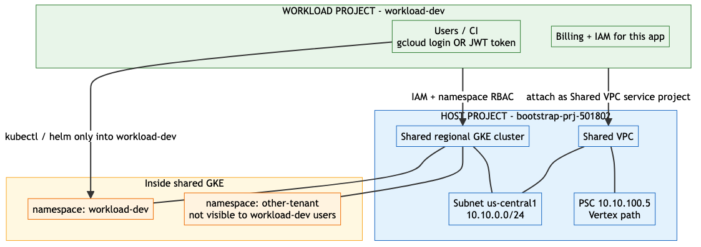
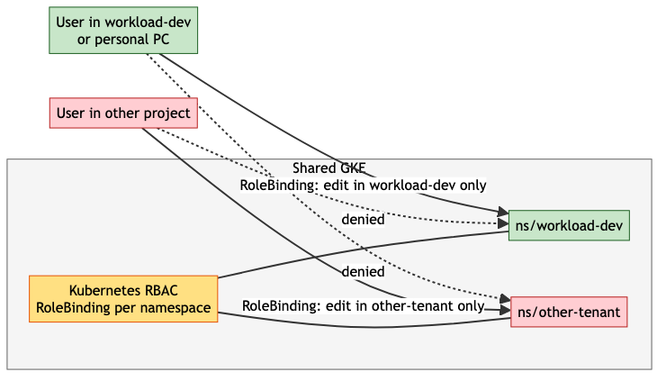
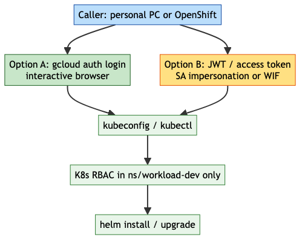
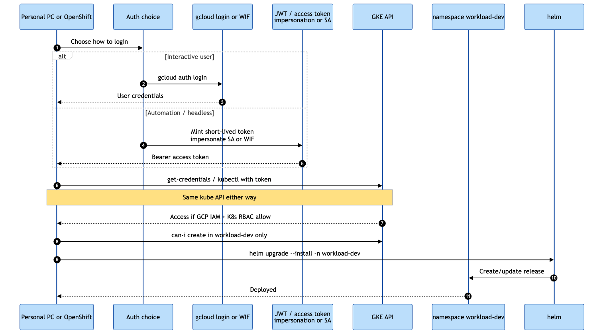
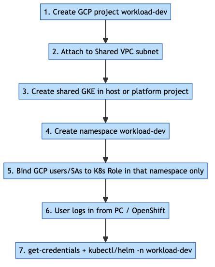
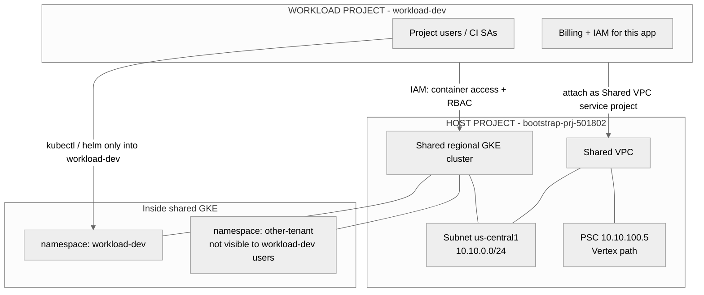
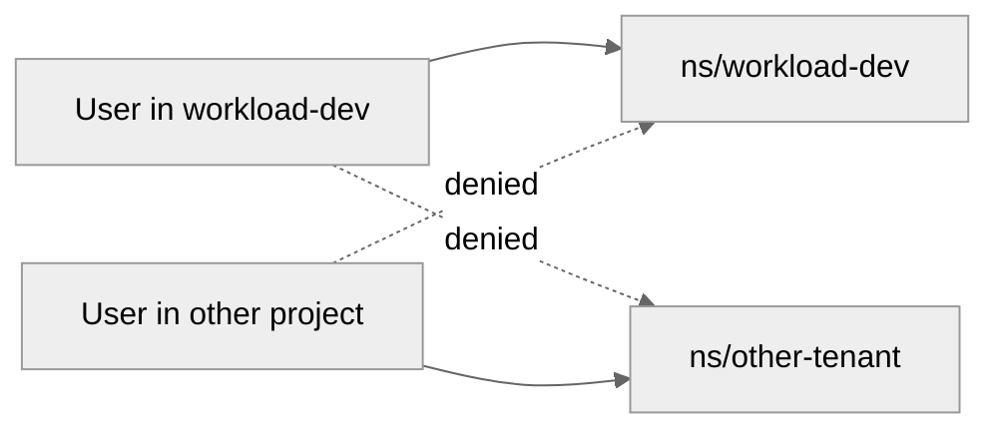
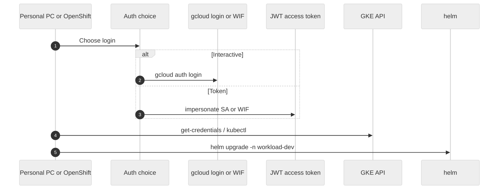
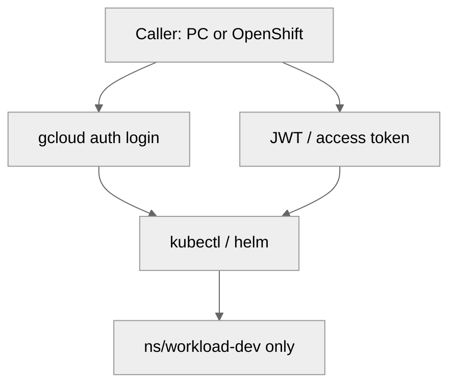

# Design: workload-dev project on Shared VPC + shared GKE namespace

Design + **Terraform code** (disabled by default so GKE does not start billing
until you flip the flags).

> **Name correction:** on Google Cloud this is **GKE**, not EKS.

GitHub dark mode breaks live Mermaid, so diagrams are **light PNGs** (Mermaid
source kept at the bottom for edits).

---

## Goal

1. Create **one workload GCP project**: `workload-dev` (≈ AWS account for apps).
2. Attach it to the **existing Shared VPC subnet** in the host project.
3. Run a **shared GKE cluster** (multi-tenant).
4. Give `workload-dev` its **own Kubernetes namespace**.
5. Users from **other projects cannot see** that namespace.
6. A user logs in from a **personal PC or OpenShift** via CLI — either
   **`gcloud auth login`** or a **JWT / access token** (SA impersonation / WIF) —
   and can `helm install` into **only** that namespace.

---

## Current baseline (today)

| Item | Now |
|---|---|
| Host / bootstrap project | `bootstrap-prj-501802` |
| VPC + subnet | **1** VPC, **1** subnet `us-central1` `10.10.0.0/24` |
| Workload / service projects | **0** |
| GKE | **0** |

---

## Target architecture



### Who owns what

| Layer | Lives in | Notes |
|---|---|---|
| Shared VPC + subnet | **Host** `bootstrap-prj-501802` | Already exists |
| Shared GKE cluster | **Host** (or a dedicated platform project later) | Nodes use Shared VPC subnet |
| Project `workload-dev` | New GCP project | Billing, IAM, app identities |
| Namespace `workload-dev` | Inside shared GKE | Soft tenancy boundary |
| Helm releases | Objects in that namespace | App team owns charts |

`workload-dev` is a **Shared VPC service project**: it uses the host subnet; it
does not create its own VPC for this design.

---

## Multitenancy: other projects cannot see this namespace

Namespaces alone are **not** enough. Isolation = **Kubernetes RBAC** (+ optional
NetworkPolicy).



| Control | Effect |
|---|---|
| Namespace `workload-dev` | Separates objects |
| Role + RoleBinding **only** in that namespace | User can `get/list/create` only there |
| No cluster-admin for app users | Cannot see other namespaces |
| NetworkPolicy (recommended) | Pods cannot talk across tenants by default |
| GCP IAM on cluster | Who may call the GKE API at all |

A user from another project gets **no** RoleBinding in `workload-dev` →
`kubectl get pods -n workload-dev` fails / empty / forbidden.

---

## Login from anywhere (PC or OpenShift) → helm install

Yes — **JWT / access-token login is a valid path**, same as interactive gcloud.
Both end at the same kube API; namespace RBAC still decides what you can see.





### Auth options

| Option | When to use | How |
|---|---|---|
| **A. `gcloud auth login`** | Human on a laptop | Browser login → `get-credentials` → kubectl/helm |
| **B. JWT / access token** | Automation, OpenShift, headless PC | Mint token (SA **impersonation** or **WIF**) → use as Bearer for GKE API / kubeconfig exec plugin |
| **C. WIF (preferred long-term)** | OpenShift / CI without SA keys | External IdP → GCP token → same kubectl/helm |

Org policy blocks downloadable SA **keys**; impersonation or WIF still give you a
short-lived **access token** (JWT-style credential) — same pattern you already
use for Vertex Gemini.

### Option A — interactive (human)

```bash
gcloud auth login
gcloud config set project workload-dev-PROJECT_ID

gcloud container clusters get-credentials SHARED_GKE_NAME \
  --region us-central1 \
  --project HOST_PROJECT_ID

kubectl auth can-i create deployments -n workload-dev   # yes
kubectl auth can-i list pods -n other-tenant            # no

helm upgrade --install myapp ./chart -n workload-dev
```

### Option B — JWT / access token (impersonation)

```bash
export CLIENT_SA=workload-dev-deployer@WORKLOAD_DEV_PROJECT.iam.gserviceaccount.com

# Short-lived access token as the deployer SA (no JSON key)
TOKEN=$(gcloud auth print-access-token --impersonate-service-account="${CLIENT_SA}")

# Point kubectl at the cluster, then use the token
gcloud container clusters get-credentials SHARED_GKE_NAME \
  --region us-central1 \
  --project HOST_PROJECT_ID

# Example: one-shot API call with bearer token (or configure kubeconfig user token)
kubectl --token="${TOKEN}" get pods -n workload-dev

helm upgrade --install myapp ./chart -n workload-dev
# helm uses the same kubeconfig; ensure the active user is the impersonated SA
# (e.g. gcloud config set auth/impersonate_service_account $CLIENT_SA)
```

Cleaner for a whole shell session:

```bash
gcloud config set auth/impersonate_service_account "${CLIENT_SA}"
gcloud container clusters get-credentials SHARED_GKE_NAME \
  --region us-central1 --project HOST_PROJECT_ID
helm upgrade --install myapp ./chart -n workload-dev
gcloud config unset auth/impersonate_service_account
```

Private cluster tip: use **Connect Gateway** or VPN so `kubectl` works off VPN
without a public control-plane endpoint.

---

## Terraform code (written, off by default)

| Path | Purpose |
|---|---|
| `tfe-workspace/modules/workload-project/` | Create `workload-dev` project + `gke-deployer` SA + Token Creator |
| `tfe-workspace/modules/shared-gke/` | Shared regional GKE, NAT, namespace, Role/RoleBinding, quota |
| `tfe-workspace/modules/workload-resources/main.tf` | Wires both modules |
| `tfe-workspace/envs/dev/main.tf` | Feature flags `workload_dev` / `shared_gke` |

### Enable when ready (costs money)

In `tfe-workspace/envs/dev/main.tf`:

1. Set your user in `workload_dev.impersonators` (e.g. `user:you@vaflt.com`).
2. Set `workload_dev.enabled = true` and `shared_gke.enabled = true`.
3. Ensure TFE SA can create projects / use billing (roles added automatically when enabled).
4. Apply (secondary subnet ranges `gke-pods` / `gke-services` are already in the VPC subnet config).

Defaults:

- `enable_private_endpoint = false` → public GKE API (laptop kubectl **without VPN**)
- `enable_private_nodes = true` → nodes private + Cloud NAT
- `attach_shared_vpc = false` until org grants Shared VPC host / xpnAdmin

### After apply — helm via impersonation

```bash
export DEPLOYER_SA=gke-deployer@vaflt-workload-dev-1.iam.gserviceaccount.com

gcloud config set auth/impersonate_service_account "${DEPLOYER_SA}"
gcloud container clusters get-credentials shared-gke-dev \
  --region us-central1 --project bootstrap-prj-501802

kubectl auth can-i create deployments -n workload-dev   # yes
helm upgrade --install myapp ./chart -n workload-dev

gcloud config unset auth/impersonate_service_account
```

---

## Build sequence (implementation order)



1. **Create GCP project** `workload-dev` (folder + billing).
2. **Attach** as Shared VPC service project; grant `networkUser` on subnet.
3. **Create shared regional GKE** on host subnet (VPC-native, 2 zones when ready).
4. **Create namespace** `workload-dev` (+ ResourceQuota / LimitRange).
5. **Bind RBAC**: map `workload-dev` users/SAs → Role in that namespace only.
6. **Document login**: `get-credentials` + `helm -n workload-dev`.
7. (Optional) Wire pods to Vertex via existing PSC `10.10.100.5` + Workload Identity.

---

## Terraform vs Helm (for the later coding phase)

| What | Tool |
|---|---|
| Project, Shared VPC attach, GKE cluster, node pools | **Terraform** |
| Namespace, ResourceQuota, LimitRange, default NetworkPolicy | **Terraform** or platform Helm |
| Role / RoleBinding for tenant users | **Terraform** or platform GitOps |
| Application charts (`helm install`) | **Helm** (app team) |

Platform owns tenancy; apps own releases.

---

## Decisions to confirm before coding

| # | Decision | Recommendation |
|---|---|---|
| 1 | Where does shared GKE live? | Host project first; split to platform project later if needed |
| 2 | Private or public control plane? | **Private** + Connect Gateway / VPN |
| 3 | Namespace name | `workload-dev` (match project key) |
| 4 | Second subnet / multi-zone now? | Add second zone subnet when HA is required |
| 5 | OpenShift access | WIF preferred over SA keys (org blocks keys) |

---

## Out of scope for v1

- Full HA VPN (cost) — document only unless you enable it
- Prod cluster split
- Automatic namespace creation for every new project (can add later)

---

## Mermaid source (for re-export)

### Architecture



### RBAC isolation



### Login → helm (gcloud or JWT)



### Auth options



---

## Next step

Code is local (not pushed). When ready:

1. Review `envs/dev/main.tf` flags and set `impersonators`
2. Ask to **commit/push** and TFE-apply with `enabled = true` when you accept GKE cost

**Not pushed** — local only until you ask.
