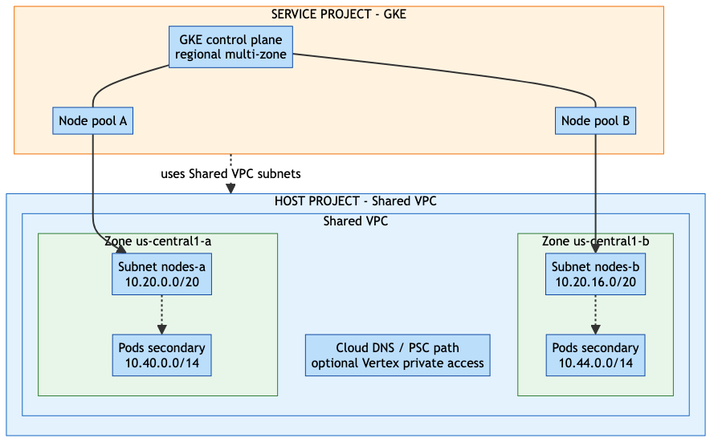
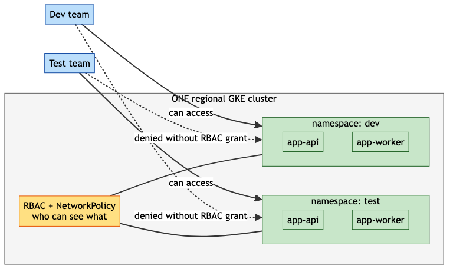
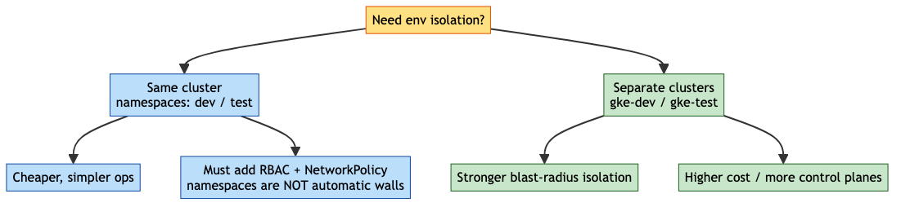
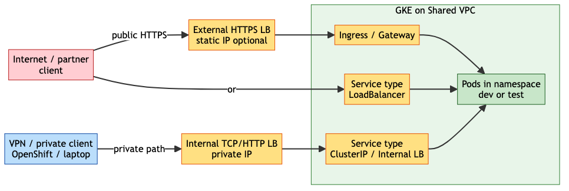

# Guide: Multi-zone GKE on Shared VPC (dev / test namespaces)

This guide answers the usual design questions for running Kubernetes **on this
GCP Shared VPC** setup: multi-zone subnets, namespaces per environment, who can
see what, static IPs, and how external clients reach apps (load balancers).

> **Correction up front:** on Google Cloud this product is **GKE** (Google
> Kubernetes Engine), not **EKS**. EKS is AWS’s managed Kubernetes. The ideas
> (multi-AZ nodes, namespaces, Ingress/LB) are similar; the network product here
> is **Shared VPC**, which is what this repo already uses for Vertex PSC.

Diagrams below are **light PNG exports** (not live Mermaid on GitHub), so they
stay readable in GitHub dark mode.

---

## Quick answers (correcting the assumptions)

| Your idea | Verdict | Correct model |
|---|---|---|
| Multi-zone cluster using **two subnets** | **Yes** | Regional GKE with nodes in ≥2 zones / ≥2 subnets for HA |
| Cluster sits on **Shared VPC** | **Yes (recommended)** | Host project owns VPC/subnets; service project owns the GKE cluster |
| Different **namespaces** for `dev` / `test` | **Yes, common** | One cluster, many namespaces — cheap and simple |
| Each env can **only see its own namespace** | **Not automatic** | You must add **RBAC** (and ideally **NetworkPolicy**). Namespaces alone do not hide things |
| Need a **static IP** always? | **No** | Optional for public/private Ingress/LB frontends you want pinned |
| Outside access needs a **load balancer**? | **Usually yes** | Public: External HTTPS LB / `LoadBalancer` Service. Private: Internal LB + VPN/Interconnect |

---

## 1. Multi-zone + two subnets on Shared VPC

Yes — that is the normal HA pattern.

- **Host project**: Shared VPC, subnets in `us-central1-a` and `us-central1-b` (example).
- **Service project**: GKE cluster (regional) places node pools across those subnets.
- Pods usually use **secondary ranges** (VPC-native / alias IPs), not only the node CIDR.



### Why two zones / two subnets?

| Benefit | Why it matters |
|---|---|
| Zone failure tolerance | Nodes in a second zone keep serving |
| Rolling upgrades | Drain one zone without taking the whole app down |
| Matches Shared VPC design | Same host VPC you already use for PSC / hybrid |

Control plane for a **regional** cluster is multi-zone by Google. Your job is to
spread **node pools** across subnets/zones.

---

## 2. Namespaces for `dev` and `test` — yes, with RBAC

Putting workloads in different namespaces is correct for soft isolation on one
cluster:

```text
namespace/dev   →  app-api, app-worker
namespace/test  →  app-api, app-worker
```

**But:** a namespace is a naming + policy boundary, not a magic firewall.

- Without **RBAC**, a user with cluster-wide permissions sees every namespace.
- Without **NetworkPolicy**, pods in `dev` can often still talk to pods in `test`.
- Secrets in `dev` are not visible by default as objects in `test`, but a powerful
  ServiceAccount or cluster-admin can still reach them.



### Minimal isolation checklist

1. Create namespaces: `dev`, `test`.
2. Bind teams with RoleBindings **scoped to that namespace only**.
3. Add NetworkPolicies (default deny + allow needed flows).
4. Separate GCP SAs / Workload Identity per namespace when calling Vertex, etc.

### When namespaces are not enough

Use **separate clusters** (`gke-dev`, `gke-test`) if you need hard blast-radius
isolation (prod vs everything else is the usual case).



---

## 3. Do you need a static IP?

| Scenario | Static IP? |
|---|---|
| Internal-only apps (VPN / OpenShift → ClusterIP / Internal LB) | Usually **no** |
| Public website / API with DNS (`api.example.com`) | **Yes, recommended** (reserve global or regional IP, point DNS) |
| Partner allowlists your egress/ingress IP | **Yes** |
| Private Service Connect to Vertex (already in this repo) | PSC has its own IP (`10.10.100.5`); unrelated to GKE Ingress IP |

Static IP is for **stable frontends**, not a requirement to “create GKE”.

Reserve example (conceptual):

```bash
# Global IP for external HTTPS load balancer / Ingress
gcloud compute addresses create gke-dev-ingress-ip --global --project=SERVICE_PROJECT

# Regional IP for internal LB
gcloud compute addresses create gke-dev-ilb-ip --region=us-central1 --subnet=nodes-a
```

---

## 4. Connecting from outside — do you need a load balancer?

**Yes, for almost all “reach my app from outside the cluster” cases.**

Pods have cluster-internal IPs. Outside clients do not talk to Pod IPs directly
in production designs. You expose via:

| Pattern | Who uses it | Front door |
|---|---|---|
| `ClusterIP` only | In-cluster callers | No LB |
| **Internal Load Balancer** | OpenShift / on-prem over VPN | Private IP LB |
| **External LoadBalancer / HTTPS Ingress** | Internet / partners | Public LB (+ optional static IP + cert) |
| IAP / Identity-Aware Proxy | Human admins | Google edge + IAP |



### Recommended defaults for this bootstrap stack

- **App traffic from OpenShift / laptop over hybrid:** Internal LB (or Ingress
  internal) — no public exposure.
- **Need public demo API:** External HTTPS LB + managed cert + Cloud Armor as needed.
- **Vertex AI calls from pods:** use the Shared VPC **PSC path** already documented
  in [GUIDE-VERTEX.md](GUIDE-VERTEX.md) / [VERTEX-AI-PSC-ONPREM.md](VERTEX-AI-PSC-ONPREM.md)
  (private `10.10.100.5`), with Workload Identity — not SA JSON keys if org policy
  blocks them.

---

## 5. Suggested layout for this org

```text
Host project (Shared VPC)
  ├─ subnet us-central1-a  (nodes + secondary ranges)
  └─ subnet us-central1-b  (nodes + secondary ranges)

Service project (GKE)
  └─ regional cluster
       ├─ namespace/dev   ← RBAC: dev team only
       └─ namespace/test  ← RBAC: test team only
```

Optional later: split **prod** into its own cluster and project.

---

## 6. EKS vs GKE (so names stay clear)

| | GKE (this GCP repo) | EKS (AWS) |
|---|---|---|
| Cloud | Google Cloud | AWS |
| Shared network | Shared VPC (host + service projects) | Shared VPC / RAM-shared subnets |
| Multi-zone | Regional cluster + multi-zone node pools | Multi-AZ node groups |
| Env split | Namespaces + RBAC, or separate clusters | Same idea |
| Outside access | GKE Gateway/Ingress, External/Internal LB | ALB/NLB Ingress, Service LB |

If you later need a true **AWS EKS** guide, say so — it is a different cloud
account model. For **this** bootstrap, implement **GKE on Shared VPC**.

---

## 7. Security notes that people miss

- Namespaces ≠ multi-tenant security by themselves.
- Prefer **Workload Identity** over downloadable keys (your org already blocks SA keys).
- Keep `dev` / `test` from sharing the same powerful GCP SA when possible.
- Public LB = attack surface; default to private + VPN for internal apps.
- Quotas / billing: GKE control plane + nodes cost money even with idle pods —
  set a [billing budget](https://console.cloud.google.com/billing/budgets).

---

## 8. Source Mermaid (for editors only)

The PNGs above were rendered from Mermaid with a forced light theme. Live Mermaid
on github.com can still go black in dark mode; **use the PNGs in this doc** when
publishing. If you edit diagrams, re-export PNGs into `docs/images/` the same way
as the Vertex diagrams.
