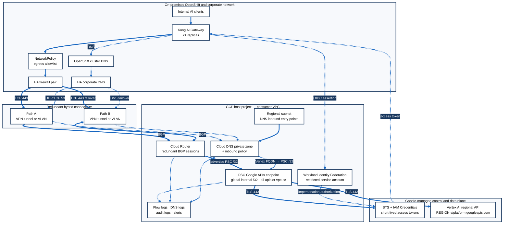
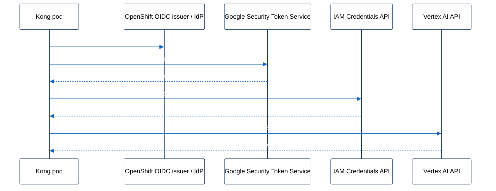

# On-premises Kong AI Gateway to Vertex AI over Private Service Connect

This runbook describes private access from Kong AI Gateway deployed on OpenShift in an on-premises network to Vertex AI. The recommended data path uses **Cloud Interconnect or HA VPN**, **Private Service Connect (PSC) for Google APIs**, private DNS, and a corporate firewall. It does not use a public Vertex AI endpoint.

> Scope: this is an architecture and implementation runbook. Substitute the example project IDs, CIDRs, regions, and names with approved values. Validate Kong AI Gateway provider/authentication support against the deployed Kong version before implementation.

## Target architecture



## GCP network components: VPC and subnet requirements

**Yes, a consumer VPC is required.** The PSC endpoint is associated with a VPC, and the HA VPN or Cloud Interconnect plus Cloud Router must connect to that same VPC. In Shared VPC, place these networking resources in the **host project**.

| GCP component | VPC required? | Subnet required? | Notes |
|---|---:|---:|---|
| PSC endpoint for Google APIs | Yes | No | It uses a reserved **global internal `/32`** with purpose `PRIVATE_SERVICE_CONNECT`; it is not an address from a regional subnet. |
| Cloud Router | Yes | No | It exchanges BGP routes for VPN or Interconnect; it has no VM interface or subnet IP. |
| HA VPN gateway | Yes | No | Regional gateway attached to the VPC. |
| Cloud Interconnect VLAN attachment | Yes | No direct subnet | Regional attachment associated with Cloud Router. |
| Cloud DNS inbound forwarding | Yes | Plan regional subnet capacity | Cloud DNS creates regional inbound-forwarder IPs in the VPC. Corporate DNS forwards queries to those IPs. |
| GCE/GKE test client or token broker | Yes | Yes | A workload needs a regional subnet. This is optional if only on-prem OpenShift calls the API. |

Reserve non-overlapping address space for:

1. The PSC global `/32`.
2. On-premises OpenShift node/pod egress CIDRs.
3. Regional VPC subnets used by DNS forwarders, test workloads, and any future private services.
4. VPN/Interconnect routing ranges.

## Multi-team and project structure

1. Use one Shared VPC host project per environment (`net-prod`, `net-nonprod`) owning the VPC, subnets, PSC endpoint, Cloud Router, hybrid connectivity, and Cloud DNS. Never share a host project across environments.
2. Give each workload team its own service project, GCP service account, WIF subject binding, Vertex quotas, and budget. The network path is shared; identity and authorization are not.
3. Onboarding the next team is then an IAM change only, with no corporate firewall, DNS, or BGP change. That is the main reason to share one path rather than build a VPC per team.
4. Create **one PSC endpoint per environment**. It is a network entry point, not a per-team or per-service resource, and it serves every workload that can reach the VPC.
5. Do not add endpoints for redundancy; availability comes from redundant tunnels/attachments and BGP. A second endpoint is justified only by a second API bundle (`all-apis` plus `vpc-sc`).
6. Grant `roles/compute.networkUser` at subnet scope, never at host-project scope.
7. Calling Vertex AI does not require the calling project to have a VPC. Subnets are needed only for Vertex features that attach to the network, such as Workbench, private custom training, and Vector Search.
8. The corporate firewall permits IP/port flows only and performs no name resolution. Note the differing rule sources: Kong pod egress CIDRs to the PSC `/32` on 443, and corporate DNS resolvers to the Cloud DNS inbound IPs on 53.

## Key design decisions

| Decision | Recommendation |
|---|---|
| API access method | PSC endpoint for **Google APIs**, not a PSC published service endpoint |
| PSC bundle | `all-apis` unless an approved VPC Service Controls design requires `vpc-sc` |
| Connectivity | HA VPN or Cloud Interconnect terminated in the same VPC as the PSC endpoint and Cloud Router |
| DNS | Split-horizon DNS; resolve only approved Vertex and token-service hostnames to the PSC endpoint |
| Authentication | Workload Identity Federation plus service-account impersonation; do not use long-lived service-account keys |
| Enforcement | Corporate firewall plus OpenShift NetworkPolicy; optionally VPC Service Controls and hierarchical firewall policy |

`all-apis` is normally needed for Vertex AI plus its supporting Google APIs. `vpc-sc` is more restrictive and is appropriate only when the required APIs and service perimeter design have been verified.

## Required inputs before implementation

Collect and approve these values first:

| Input | Example / purpose |
|---|---|
| GCP host project and consumer VPC | PSC endpoint, Cloud DNS, Cloud Router, and hybrid connectivity location |
| Vertex AI project and region | `vertex-project`, `us-central1` |
| On-prem OpenShift node/pod egress CIDRs | Firewall source ranges and route validation |
| PSC global internal IP | One unused `/32`, for example `10.80.0.10` |
| Hybrid transport | Existing HA VPN or Cloud Interconnect plus BGP Cloud Router |
| Corporate DNS servers | Targets for conditional forwarding |
| Kong version and provider mode | Confirms Vertex AI endpoint and Google token support |
| Identity issuer | OpenShift/Kubernetes OIDC issuer or approved corporate IdP for federation |
| Kong namespace and Kubernetes service account | Pins the WIF attribute condition and the impersonation subject |

## Terraform delivery model

All GCP resources in this design must be created and changed through Terraform. Console or imperative CLI resource creation is break-glass only and must be followed by import and reconciliation.

Recommended root-module layout:

```text
vertex-ai-private-access/
├── envs/
│   ├── nonprod/
│   └── prod/
├── modules/
│   ├── project-services/
│   ├── consumer-vpc/
│   ├── hybrid-connectivity/
│   ├── psc-google-apis/
│   ├── hybrid-dns/
│   ├── kong-workload-identity/
│   └── observability/
└── policies/
```

Production controls:

1. Use a dedicated remote state/workspace for this network stack.
2. Commit `.terraform.lock.hcl`; test and promote provider upgrades deliberately.
3. Pin module versions and protect production applies with review and policy checks.
4. Use separate variables and state for non-production and production.
5. Import existing VPC, Router, VPN, DNS, and IAM resources before Terraform modifies them.
6. Run `terraform fmt`, `validate`, security scanning, plan review, and policy checks in CI.
7. Never place access tokens, service-account keys, or private key material in Terraform state.

Provider example:

```hcl
terraform {
  required_version = "~> 1.15"

  required_providers {
    google = {
      source  = "hashicorp/google"
      version = "~> 7.0"
    }
    google-beta = {
      source  = "hashicorp/google-beta"
      version = "~> 7.0"
    }
  }
}

provider "google" {
  project = var.host_project_id
  region  = var.region
}

# Keep beta scoped to resources that still require it; do not migrate every
# existing Google resource to google-beta.
provider "google-beta" {
  project = var.host_project_id
  region  = var.region
}
```

Use the organization-approved provider major version. The committed lock file pins the exact tested release.

## 1. Build or adopt the GCP foundation with Terraform

The PSC endpoint, Cloud Router, hybrid attachment, private DNS policy, and DNS entry points must be in the same consumer VPC. In Shared VPC, deploy them in the **host project**.

### 1.1 Enable APIs

```hcl
locals {
  required_services = toset([
    "aiplatform.googleapis.com",
    "compute.googleapis.com",
    "dns.googleapis.com",
    "iam.googleapis.com",
    "iamcredentials.googleapis.com",
    "logging.googleapis.com",
    "networkconnectivity.googleapis.com",
    "servicedirectory.googleapis.com",
    "serviceusage.googleapis.com",
    "sts.googleapis.com",
  ])
}

resource "google_project_service" "required" {
  for_each = local.required_services

  project            = var.host_project_id
  service            = each.value
  disable_on_destroy = false
}
```

If Vertex AI is in a separate service project, enable `aiplatform.googleapis.com`, IAM Credentials, and STS there as required. Keep foundational APIs enabled on destroy.

### 1.2 Create or import the VPC and regional subnet

```hcl
resource "google_compute_network" "consumer" {
  project                 = var.host_project_id
  name                    = var.network_name
  auto_create_subnetworks = false
  routing_mode            = "GLOBAL"
}

resource "google_compute_subnetwork" "hybrid" {
  project                  = var.host_project_id
  name                     = "${var.network_name}-${var.region}"
  region                   = var.region
  network                  = google_compute_network.consumer.id
  ip_cidr_range            = var.hybrid_subnet_cidr
  private_ip_google_access = true

  log_config {
    aggregation_interval = "INTERVAL_5_SEC"
    flow_sampling        = 0.5
    metadata             = "INCLUDE_ALL_METADATA"
  }
}
```

The subnet is used for Cloud DNS inbound entry points and optional test/token-broker workloads. The global PSC address itself is **not allocated from this subnet**.

If the VPC/subnet already exists, reference it with data sources or import it; do not create a parallel network.

## 2. Create the PSC endpoint for Google APIs with Terraform

```hcl
resource "google_compute_global_address" "vertex_psc" {
  provider = google-beta

  project      = var.host_project_id
  name         = "psc-vertex-googleapis"
  address_type = "INTERNAL"
  purpose      = "PRIVATE_SERVICE_CONNECT"
  network      = google_compute_network.consumer.id
  address      = var.psc_ip
}

resource "google_compute_global_forwarding_rule" "vertex_psc" {
  provider = google-beta

  project               = var.host_project_id
  name                  = "psc-vertex"
  network               = google_compute_network.consumer.id
  ip_address            = google_compute_global_address.vertex_psc.id
  target                = var.psc_api_bundle # "all-apis" or "vpc-sc"
  load_balancing_scheme = ""
  no_automate_dns_zone  = true

  depends_on = [google_project_service.required]
}
```

Production rules:

- `var.psc_ip` must be one approved, unused, non-overlapping RFC1918 address; advertise it as `/32`.
- Use `all-apis` only after approving its broader API reachability.
- Use `vpc-sc` when the required APIs are supported and the service perimeter is enforced.
- Manage DNS explicitly; do not point Kong to the raw IP because TLS relies on the hostname/SNI.
- Add `prevent_destroy` to the PSC address and forwarding rule after initial rollout if your change policy requires explicit break-glass deletion.

## 3. Build redundant hybrid routing with Terraform

Production connectivity requires two independent paths:

- **HA VPN:** HA VPN gateway, two tunnels, redundant peer gateways, and redundant BGP sessions.
- **Cloud Interconnect:** redundant Interconnect connections and VLAN attachments in separate edge availability domains.

Terraform ownership normally includes:

```text
google_compute_ha_vpn_gateway
google_compute_external_vpn_gateway
google_compute_vpn_tunnel (two or four)
google_compute_router
google_compute_router_interface
google_compute_router_peer
```

or, for Interconnect:

```text
google_compute_interconnect_attachment (redundant VLAN attachments)
google_compute_router
google_compute_router_peer
```

Advertise the PSC `/32` while preserving all existing advertisements:

```hcl
resource "google_compute_router" "hybrid" {
  project = var.host_project_id
  name    = var.router_name
  region  = var.region
  network = google_compute_network.consumer.id

  bgp {
    asn               = var.gcp_bgp_asn
    advertise_mode    = "CUSTOM"
    advertised_groups = ["ALL_SUBNETS"]

    advertised_ip_ranges {
      range       = "${var.psc_ip}/32"
      description = "PSC endpoint for Vertex AI and Google APIs"
    }

    dynamic "advertised_ip_ranges" {
      for_each = var.additional_advertised_cidrs
      content {
        range       = advertised_ip_ranges.value.cidr
        description = advertised_ip_ranges.value.description
      }
    }
  }
}
```

Do not replace an existing Cloud Router with this sample. Import it or update its canonical Terraform module, and merge the PSC `/32` into the complete advertisement list. A partial list can remove production routes.

Routing acceptance criteria:

1. Both BGP paths are established.
2. GCP learns the approved OpenShift egress CIDRs.
3. On-premises learns the PSC `/32` on both paths.
4. Return traffic is symmetric enough for stateful corporate firewalls.
5. Failure of either tunnel/VLAN/BGP session does not interrupt requests.

## 4. Configure private DNS with Terraform

DNS determines whether Kong reaches Vertex AI privately. The TLS hostname must remain a valid Google API hostname; only the IP resolution changes.

### Recommended production choice: exact split-horizon zones

Override only the hostnames used by Kong. Do not override all of `googleapis.com` unless the organization deliberately wants every eligible Google API to use this PSC endpoint.

```hcl
locals {
  # Each exact FQDN receives its own private zone so unrelated Google APIs keep
  # their normal resolution path.
  psc_api_hostnames = {
    vertex        = "${var.vertex_region}-aiplatform.googleapis.com"
    sts           = "sts.googleapis.com"
    iamcredentials = "iamcredentials.googleapis.com"
  }
}

resource "google_dns_managed_zone" "psc_api" {
  for_each = local.psc_api_hostnames

  project     = var.host_project_id
  name        = "psc-${each.key}"
  dns_name    = "${each.value}."
  description = "Private resolution of ${each.value} through PSC"
  visibility  = "private"

  private_visibility_config {
    networks {
      network_url = google_compute_network.consumer.id
    }
  }
}

resource "google_dns_record_set" "psc_api" {
  for_each = local.psc_api_hostnames

  project      = var.host_project_id
  managed_zone = google_dns_managed_zone.psc_api[each.key].name
  name         = "${each.value}."
  type         = "A"
  ttl          = 300
  rrdatas      = [google_compute_global_address.vertex_psc.address]
}

resource "google_dns_policy" "hybrid_inbound" {
  project                   = var.host_project_id
  name                      = "hybrid-inbound-dns"
  enable_inbound_forwarding = true
  enable_logging            = true

  networks {
    network_url = google_compute_network.consumer.id
  }
}
```

Cloud DNS allocates inbound-forwarder IPs from the primary range of applicable regional subnets. Send corporate DNS queries to entry points in the same region as the VPN tunnel or Interconnect VLAN attachment.

The Terraform API does not reliably expose those generated entry-point IPs as normal `google_dns_policy` outputs. Treat their post-apply discovery and transfer to the corporate DNS team as an explicit deployment gate. If the corporate DNS platform has a Terraform provider/API, manage the conditional forwarders in a separate on-prem module; otherwise use a controlled network change ticket.

Corporate DNS must conditionally forward these exact zones to both approved Cloud DNS inbound IPs:

```text
REGION-aiplatform.googleapis.com
sts.googleapis.com
iamcredentials.googleapis.com
```

DNS acceptance criteria:

1. Both corporate resolvers can query both Cloud DNS inbound entry points over UDP and TCP 53.
2. From a Kong pod, every approved hostname resolves to the PSC `/32`.
3. Unrelated `*.googleapis.com` names are not accidentally overridden.
4. DNS logging is enabled and monitored.
5. TTL supports rollback without causing excessive resolver load.

## 5. Configure GCP IAM and workload identity

Do not place a long-lived Google service-account key in an OpenShift Secret.

Recommended flow:



Create the identity resources with Terraform:

```hcl
resource "google_iam_workload_identity_pool" "kong" {
  project                   = var.identity_project_id
  workload_identity_pool_id = "kong-openshift"
  display_name              = "Kong on OpenShift"
}

resource "google_iam_workload_identity_pool_provider" "kong_oidc" {
  project                            = var.identity_project_id
  workload_identity_pool_id          = google_iam_workload_identity_pool.kong.workload_identity_pool_id
  workload_identity_pool_provider_id = "openshift-oidc"
  display_name                       = "OpenShift OIDC"

  attribute_mapping = {
    "google.subject"       = "assertion.sub"
    "attribute.namespace" = "assertion['kubernetes.io']['namespace']"
    "attribute.sa_name"   = "assertion['kubernetes.io']['serviceaccount']['name']"
  }

  # Validate the actual OpenShift JWT claims first. The condition must pin the
  # issuer/audience, namespace, and service account used by Kong. Example:
  #   assertion['kubernetes.io']['namespace'] == 'kong' &&
  #   assertion['kubernetes.io']['serviceaccount']['name'] == 'kong-vertex'
  attribute_condition = var.oidc_attribute_condition

  oidc {
    issuer_uri        = var.openshift_oidc_issuer
    allowed_audiences = [var.google_wif_audience]
  }
}

resource "google_service_account" "kong_vertex" {
  project      = var.vertex_project_id
  account_id   = "kong-vertex-ai"
  display_name = "Kong Vertex AI runtime identity"
}

resource "google_project_iam_member" "kong_vertex_user" {
  project = var.vertex_project_id
  role    = "roles/aiplatform.user"
  member  = "serviceAccount:${google_service_account.kong_vertex.email}"
}

locals {
  # OpenShift sets assertion.sub to this value, which is mapped to google.subject.
  kong_subject = "system:serviceaccount:${var.kong_namespace}:${var.kong_k8s_service_account}"
}

resource "google_service_account_iam_member" "kong_impersonation" {
  service_account_id = google_service_account.kong_vertex.name
  role               = "roles/iam.workloadIdentityUser"

  # Exact-subject binding. A namespace-wide principalSet would let every
  # workload in the namespace impersonate this service account.
  member = format(
    "principal://iam.googleapis.com/%s/subject/%s",
    google_iam_workload_identity_pool.kong.name,
    local.kong_subject,
  )

  depends_on = [google_iam_workload_identity_pool_provider.kong_oidc]
}
```

The service account is never handed to Kong, and no key is ever created for it. The `workloadIdentityUser` binding above is the entire link: it authorizes one specific OpenShift service account to *act as* `kong-vertex-ai`. See [supplying Google credentials to Kong pods](#supplying-google-credentials-to-kong-pods) for the corresponding OpenShift objects.

Identity production requirements:

1. Inspect a real projected OpenShift service-account JWT and adjust mappings/conditions to its exact claims.
2. Restrict both namespace and Kubernetes service-account name; namespace-only authorization is insufficient on a shared cluster.
3. Restrict the audience and issuer. Never leave `attribute_condition` empty.
4. Google must fetch the issuer's JWKS to validate the token signature. On-premises OpenShift issuers are commonly not reachable from Google, in which case supply the JWKS directly on the provider (`jwks_json`) and define a rotation process. Confirm reachability early; this blocks the entire exchange.
5. Use a dedicated GCP service account per environment.
6. Grant only the Vertex roles required by the selected model/API; avoid Editor/Owner.
7. Confirm the installed Kong plugin supports an external-account/WIF credential chain on on-prem OpenShift. If it does not, use an approved token broker/sidecar that supplies short-lived access tokens. Do not fall back to a long-lived service-account key.
8. Set `auth.allow_override = false` in Kong so clients cannot supply replacement upstream credentials.

### Why WIF applies here but not to every GCP integration

WIF requires two things: the caller must invoke Google APIs as an identity, and it must present a token from an issuer Google can verify. Kong qualifies because we own the OpenShift OIDC issuer and can pin its issuer, audience, namespace, and subject. Third-party SaaS such as Prisma Cloud does not, because only the vendor can operate the token issuer, so it still authenticates with a downloaded service-account key. Where a key is unavoidable, treat it as a reviewed exception with key-expiry policy, read-only roles, and audit-log alerting — never as the pattern for our own workloads.

## 6. Configure corporate and GCP firewall controls

### Corporate firewall

Allow only required paths:

| Source | Destination | Protocol/port | Purpose |
|---|---|---|---|
| Kong/OpenShift egress CIDRs | PSC endpoint IP (`10.80.0.10`) | TCP 443 | Vertex AI and approved Google API traffic |
| Corporate DNS resolvers | Cloud DNS inbound forwarder IPs | UDP/TCP 53 | Private DNS resolution |
| Kong/OpenShift egress CIDRs | Identity issuer, if external | TCP 443 | Obtain workload assertion |

Block direct public internet egress to `*.googleapis.com` for the Kong workload if the objective is to enforce private PSC access. Do not perform TLS interception that changes the SNI/hostname or breaks Google certificate validation.

### GCP firewall and policy

Manage VPC firewall rules, hierarchical/network firewall policies, and organization policies in their canonical Terraform stacks. Do not create one-off rules in this workload root.

Required policy intent:

1. Permit only approved OpenShift egress CIDRs to the PSC `/32` on TCP 443.
2. Permit only corporate DNS resolver CIDRs to Cloud DNS inbound IPs on UDP/TCP 53.
3. Deny other sources to the PSC `/32` where centralized policy supports that enforcement.
4. Deny direct public Google API egress from Kong if private routing is mandatory.
5. Log allow and deny decisions during rollout and at a security-approved sampling rate afterward.
6. Confirm `compute.disablePrivateServiceConnectCreationForConsumers` and related organization constraints allow this approved PSC type.

### VPC Service Controls

PSC creates a private path; it is not a data-exfiltration boundary by itself. For sensitive prompts or data:

1. Place the Vertex AI project and required supporting services in a VPC Service Controls perimeter.
2. Start the perimeter change in dry-run mode and inspect violations.
3. Verify Vertex AI, STS, IAM Credentials, logging, storage, and any model-dependent APIs used by the workload.
4. Prefer the PSC `vpc-sc` bundle when every required API is supported.
5. Define ingress/egress policies for the federated on-premises identity without granting broad project access.
6. Promote to enforced mode only after non-production and failover tests pass.

## 7. Configure Kong AI Gateway and OpenShift

Kong tasks depend on the installed Kong AI Gateway version and chosen AI plugin/provider. The configuration must:

1. Set the Vertex AI region and model/endpoint.
2. Set the API base hostname to the approved split-horizon standard hostname (or an explicitly approved PSC-specific FQDN).
3. Use short-lived Google credentials from workload identity; never bake a Google key into an image or plain Kubernetes Secret.
4. Set TLS server-name verification to the chosen Google hostname.
5. Restrict the route/plugin to approved Kong services, consumers, and models.
6. Set request size, timeout, rate limit, and retry policies appropriate for model inference.
7. Emit audit-safe metrics and logs; do not log prompts, tokens, or credentials unless explicitly approved.
8. Run at least two Kong replicas with topology spread, PodDisruptionBudget, readiness probes, and tested connection draining.
9. Use a circuit breaker and bounded retries; do not retry non-idempotent requests blindly.
10. Apply per-consumer/model quotas and cost controls.

OpenShift tasks:

1. Apply a NetworkPolicy allowing only Kong pods to egress to the PSC endpoint and approved DNS/identity destinations.
2. Ensure node/pod egress uses CIDRs advertised to GCP.
3. If a corporate egress proxy exists, add explicit bypass/no-proxy handling for the PSC endpoint and private DNS names.
4. Store only non-secret workload identity configuration in ConfigMaps; use the platform’s secret mechanism for any required confidential material.

### Supplying Google credentials to Kong pods

Kong does not receive the Google service account or any key for it. OpenShift issues the Kong pod a short-lived, audience-scoped JWT, and GCP is configured to accept that JWT as authorization to impersonate `kong-vertex-ai`. Two objects connect the two sides.

**1. Credential configuration.** This tells the Google client library where to find the pod's token and which service account to impersonate. It holds only identifiers and URLs, no secret material, so it belongs in a ConfigMap:

```hcl
locals {
  wif_audience = format(
    "//iam.googleapis.com/%s/providers/%s",
    google_iam_workload_identity_pool.kong.name,
    google_iam_workload_identity_pool_provider.kong_oidc.workload_identity_pool_provider_id,
  )
}

resource "kubernetes_config_map_v1" "kong_gcp_credential_config" {
  metadata {
    name      = "kong-gcp-credential-config"
    namespace = var.kong_namespace
  }

  data = {
    "credential-config.json" = jsonencode({
      type               = "external_account"
      audience           = local.wif_audience
      subject_token_type = "urn:ietf:params:oauth:token-type:jwt"
      token_url          = "https://sts.googleapis.com/v1/token"

      service_account_impersonation_url = format(
        "https://iamcredentials.googleapis.com/v1/projects/-/serviceAccounts/%s:generateAccessToken",
        google_service_account.kong_vertex.email,
      )

      credential_source = {
        file   = "/var/run/secrets/gcp/token"
        format = { type = "text" }
      }
    })
  }
}
```

`service_account_impersonation_url` is the only place the service-account email appears on the OpenShift side. It is a reference to an identity, not a credential for it.

**2. Projected token and mounts** in the Kong pod spec. The kubelet mints the JWT and rotates it automatically:

```yaml
serviceAccount:
  create: true
  name: kong-vertex

env:
  GOOGLE_APPLICATION_CREDENTIALS: /etc/gcp/credential-config.json

extraVolumes:
  - name: gcp-token
    projected:
      sources:
        - serviceAccountToken:
            path: token
            # Equals local.wif_audience above. Render it from the Terraform
            # output rather than hand-copying the project number.
            audience: //iam.googleapis.com/projects/PROJECT_NUMBER/locations/global/workloadIdentityPools/kong-openshift/providers/openshift-oidc
            expirationSeconds: 3600
  - name: gcp-credential-config
    configMap:
      name: kong-gcp-credential-config

extraVolumeMounts:
  - name: gcp-token
    mountPath: /var/run/secrets/gcp
    readOnly: true
  - name: gcp-credential-config
    mountPath: /etc/gcp
    readOnly: true
```

These values must agree exactly, and a mismatch in any one of them fails the token exchange:

| Value | Must match |
|---|---|
| Projected token `audience` | `allowed_audiences` on the WIF provider, and `audience` in `credential-config.json` |
| `credential_source.file` | The `gcp-token` mount path plus `/token` |
| Pod's Kubernetes service account | The service account pinned in `attribute_condition` and in the impersonation binding subject |
| `service_account_impersonation_url` | `google_service_account.kong_vertex.email` |

At request time the library reads the projected token, exchanges it at `sts.googleapis.com` for a federated token, calls `iamcredentials.googleapis.com` to impersonate the service account, caches the resulting access token for roughly an hour, and sets it as a bearer token on the Vertex AI call.

Both `sts.googleapis.com` and `iamcredentials.googleapis.com` must resolve to the PSC endpoint and be reachable on TCP 443. Authentication traverses the same private path as inference traffic, which is why the `all-apis` bundle is required and why those two hostnames appear in the DNS forwarding list.

Verify from inside a running Kong pod before configuring the AI plugin:

```bash
# Confirm the projected token carries the expected subject and audience.
# The JWT payload is base64url and unpadded, so pad it before decoding.
payload=$(cut -d. -f2 /var/run/secrets/gcp/token | tr '_-' '/+')
while [ $((${#payload} % 4)) -ne 0 ]; do payload="${payload}="; done
printf '%s' "$payload" | base64 -d

# Confirm auth endpoints resolve to the PSC address, not a public IP
getent hosts sts.googleapis.com iamcredentials.googleapis.com
```

If the installed Kong AI plugin does not support an `external_account` credential chain, run an approved sidecar token broker that performs the exchange and supplies short-lived access tokens to Kong. Do not fall back to a long-lived service-account key.

### Egress policy

Manage OpenShift resources through the existing GitOps flow or Terraform Kubernetes provider. Example egress policy:

```hcl
resource "kubernetes_network_policy_v1" "kong_vertex_egress" {
  metadata {
    name      = "kong-vertex-egress"
    namespace = var.kong_namespace
  }

  spec {
    pod_selector {
      match_labels = {
        "app.kubernetes.io/name" = "kong"
      }
    }

    policy_types = ["Egress"]

    egress {
      ports {
        protocol = "TCP"
        port     = "443"
      }
      to {
        ip_block {
          cidr = "${var.psc_ip}/32"
        }
      }
    }

    # Kong pods normally query OpenShift cluster DNS. Cluster DNS then forwards
    # the selected private zones to corporate DNS.
    dynamic "egress" {
      for_each = toset(var.openshift_dns_ips)
      content {
        ports {
          protocol = "UDP"
          port     = "53"
        }
        ports {
          protocol = "TCP"
          port     = "53"
        }
        to {
          ip_block {
            cidr = "${egress.value}/32"
          }
        }
      }
    }
  }
}
```

Do not manage confidential Kong values directly with `kubernetes_secret` unless storing them in Terraform state is explicitly approved and the backend is suitably protected.

## 8. Observability and production operations

Create monitoring and alert resources through Terraform:

| Signal | Required alert |
|---|---|
| Cloud Router BGP session | Any session down; critical when redundancy is lost |
| HA VPN tunnel / VLAN attachment | Tunnel or attachment down, packet drops, SLA risk |
| DNS | Inbound query failures, unexpected NXDOMAIN, latency increase |
| VPC Flow Logs | Unexpected sources to PSC, unexpected destinations from Kong |
| IAM audit logs | Failed federation, denied impersonation, unexpected principals |
| Vertex AI | 4xx/5xx, quota exhaustion, latency, token usage, model errors |
| Kong | Upstream latency/errors, rejected requests, retries, rate limits, replica health |
| Cost | Vertex token/model spend and abnormal daily growth |

Production requirements:

1. Route audit, DNS, network, and Kong logs to the approved SIEM.
2. Redact prompts, responses, authorization headers, tokens, and sensitive model inputs.
3. Define SLOs for availability and latency, with paging tied to user impact.
4. Maintain quota headroom and request increases before launch.
5. Test certificate trust, token refresh, DNS TTL behavior, and BGP failover quarterly.
6. Document owners and escalation paths for Kong, OpenShift, firewall, DNS, network, IAM, Vertex AI, and Terraform.

## 9. Validation and production rollout

Perform validation from an approved OpenShift debug pod before enabling production Kong routes.

1. **DNS**

   ```bash
   dig +short us-central1-aiplatform.googleapis.com
   ```

   Expected: the PSC internal IP, not a public Google IP.

2. **Route**

   ```bash
   ip route get PSC_ENDPOINT_IP
   ```

   Expected: route traverses the approved corporate hybrid path.

3. **TLS**

   ```bash
   openssl s_client \
     -connect PSC_ENDPOINT_IP:443 \
     -servername us-central1-aiplatform.googleapis.com
   ```

   Expected: valid Google certificate chain and hostname validation.

4. **Token**

   Exercise the federation exchange directly, using the projected token mounted in the pod:

   ```bash
   curl -s -X POST https://sts.googleapis.com/v1/token \
     -d grant_type=urn:ietf:params:oauth:grant-type:token-exchange \
     -d requested_token_type=urn:ietf:params:oauth:token-type:access_token \
     -d subject_token_type=urn:ietf:params:oauth:token-type:jwt \
     -d scope=https://www.googleapis.com/auth/cloud-platform \
     -d audience="$WIF_AUDIENCE" \
     -d subject_token="$(cat /var/run/secrets/gcp/token)"
   ```

   Expected: a federated token. A failure here means the issuer, audience, or attribute condition does not match the JWT claims, or Google cannot validate the issuer's JWKS. Then confirm impersonation succeeds against `iamcredentials.googleapis.com` and that the resulting token's subject is the intended GCP service account.

5. **Vertex API**

   Send a least-privilege test request to the target model or endpoint. Expected: success through PSC with no public egress.

6. **Observability**

   Confirm corporate firewall logs, Cloud Router routes, VPC Flow Logs, and Kong logs show the intended private path.

7. **Failover**

   Disable each hybrid path separately. DNS, token exchange, and Vertex requests must continue without manual intervention.

8. **Public-path denial**

   Prove the Kong workload cannot bypass PSC to a public Vertex AI IP when private-only access is required.

Rollout sequence:

```mermaid
%%{init: {'theme':'base','themeVariables': {'background':'#ffffff','mainBkg':'#ffffff','textColor':'#000000','primaryColor':'#ffffff','primaryTextColor':'#000000','primaryBorderColor':'#17365d','lineColor':'#1565c0','edgeLabelBackground':'#17365d','fontFamily':'Arial','fontSize':'12px'},'themeCSS': 'svg { background-color: #ffffff !important; } .flowchart-link, .edgePath .path { stroke: #1565c0 !important; stroke-width: 3px !important; } marker path, .marker { fill: #1565c0 !important; stroke: #1565c0 !important; } .edgeLabel rect, .labelBkg { fill: #17365d !important; stroke: #17365d !important; opacity: 1 !important; } .edgeLabel, .edgeLabel span, .edgeLabel p, .edgeLabel text, .edgeLabel tspan { color: #ffffff !important; fill: #ffffff !important; background-color: #17365d !important; } .nodeLabel, .nodeLabel p { color: #000000 !important; }'}}%%
flowchart LR
  PLAN["Terraform plan + policy checks"] --> NONPROD["Non-production apply"]
  NONPROD --> TEST["DNS · TLS · WIF · Vertex · failover tests"]
  TEST --> CHANGE["Firewall/DNS production change window"]
  CHANGE --> CANARY["Kong canary traffic"]
  CANARY --> PROD["Progressive production rollout"]
  PROD --> OBSERVE["Observe SLOs, cost, and security logs"]
  linkStyle default stroke:#1565c0,stroke-width:3px,color:#ffffff
```



## 10. Rollback

1. Disable the Kong route/plugin using the PSC hostname.
2. Preserve logs and route/DNS evidence for review.
3. Return traffic to the last approved endpoint/path only if security policy allows it.
4. Revert Terraform configuration through a reviewed commit; never edit state manually as the first response.
5. Do not destroy the PSC endpoint, route advertisements, WIF provider, or DNS records until traffic and cached DNS are fully drained.
6. If identity is compromised, disable the WIF provider and Kong route first, then investigate before restoration.

## References

- [Use Private Service Connect to access Agent Platform from on-premises](https://cloud.google.com/vertex-ai/docs/general/vertex-psc-gen-ai)
- [Vertex AI API access methods](https://cloud.google.com/vertex-ai/docs/general/googleapi-access-methods)
- [About accessing Google APIs through endpoints](https://cloud.google.com/vpc/docs/about-accessing-google-apis-endpoints)
- [Cloud DNS inbound forwarding for hybrid DNS](https://cloud.google.com/vpc/docs/access-regional-google-apis-endpoints)
- [Terraform Google global forwarding rule](https://registry.terraform.io/providers/hashicorp/google/latest/docs/resources/compute_global_forwarding_rule)
- [Terraform Cloud DNS policy](https://registry.terraform.io/providers/hashicorp/google/latest/docs/resources/dns_policy)
- [Terraform Cloud Router](https://registry.terraform.io/providers/hashicorp/google/latest/docs/resources/compute_router)
- [Kong Vertex AI provider](https://developer.konghq.com/ai-gateway/ai-providers/vertex/)

## Things to worry about

1. **Kong WIF compatibility:** confirm the exact Kong version can consume an external-account credential on on-prem OpenShift. Do not assume GKE workload identity behavior applies unchanged.
2. **Private OIDC issuer:** Google must validate the OpenShift issuer/JWKS. If it is private, design secure JWKS upload and rotation before rollout.
3. **PSC is not an exfiltration boundary:** combine it with egress controls, IAM, and VPC Service Controls where data sensitivity requires them.
4. **Wrong API bundle:** `all-apis` is broader; `vpc-sc` can break unsupported dependencies. Inventory and test every API first.
5. **DNS is the steering control:** a correct PSC endpoint with incorrect DNS still sends clients to public endpoints or causes TLS failures.
6. **Generated DNS inbound IPs:** Cloud DNS entry-point IPs are regional and operationally discovered after apply; corporate DNS automation must account for them.
7. **No subnet for the global PSC IP:** do not allocate the PSC `/32` from a subnet range. A subnet is still needed for DNS inbound entry points and regional workloads.
8. **Route replacement risk:** changing a Cloud Router to custom advertisements can remove existing prefixes. Merge all current routes into Terraform before applying.
9. **Stateful firewall asymmetry:** ECMP/BGP failover can create asymmetric paths. Validate both directions through the corporate firewall pair.
10. **Single-path design:** one VPN tunnel, VLAN attachment, DNS resolver, firewall, or Kong replica is not production ready.
11. **Overlapping CIDRs:** PSC IP, VPC subnet, OpenShift node/pod/service networks, and corporate routes must not overlap.
12. **TLS interception:** corporate inspection must not replace certificates or alter SNI unless the Kong/Google trust design explicitly supports it.
13. **Credential leakage:** do not store service-account keys, OIDC assertions, access tokens, or confidential Kong configuration in Git or Terraform state.
14. **Overprivileged IAM:** restrict the WIF provider by issuer, audience, namespace, and service-account identity; keep Vertex roles least-privilege.
15. **Public fallback:** explicitly test that Kong cannot silently bypass PSC when private-only access is a requirement.
16. **Prompt and response logging:** AI payloads can contain regulated data. Default to payload logging off and apply approved redaction.
17. **Model region and residency:** verify that the chosen model is available in the selected region and meets data-residency requirements.
18. **Quota and cost:** enforce per-consumer limits, alerts, and model allowlists before exposing Kong to production clients.
19. **Timeout and retry storms:** generative calls can be long-running. Bound retries, use jitter, and tune Kong/upstream timeouts together.
20. **Provider and module drift:** commit lock files, pin module versions, and promote Terraform changes through non-production.
21. **Destructive Terraform changes:** protect PSC IPs, DNS zones, WIF resources, and hybrid networking with review controls and optional `prevent_destroy`.
22. **Rollback dependencies:** DNS TTL, token caches, connection pools, and BGP convergence mean rollback is not instantaneous.
23. **Ownership gaps:** name accountable teams for Kong, OpenShift, corporate firewall, DNS, hybrid network, GCP IAM, Vertex AI, and Terraform state.
