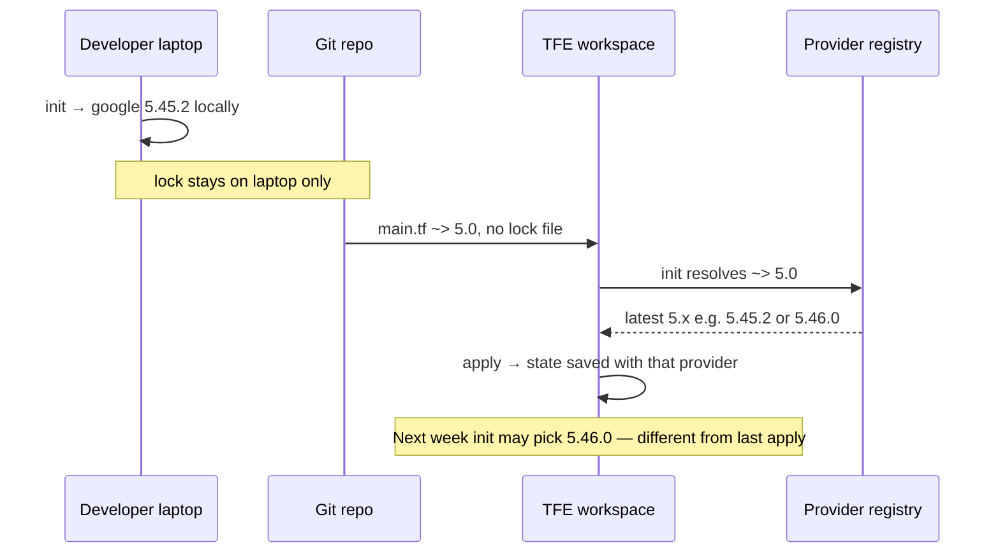
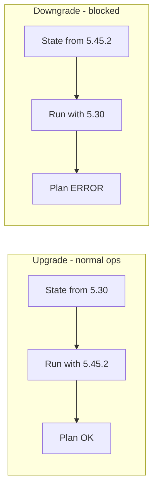
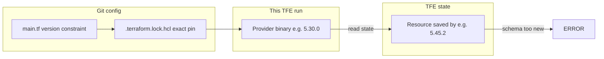
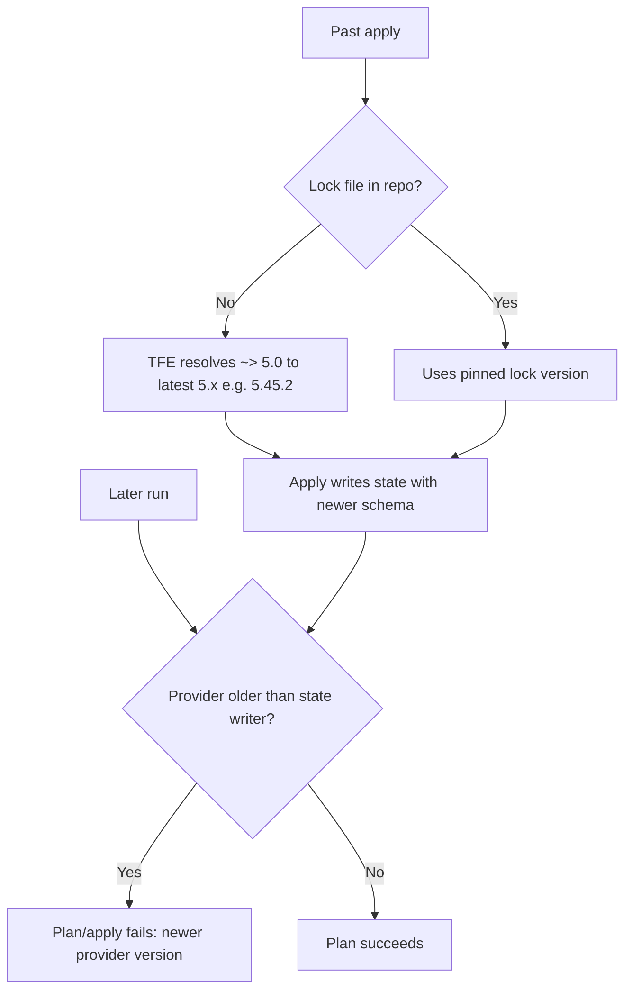
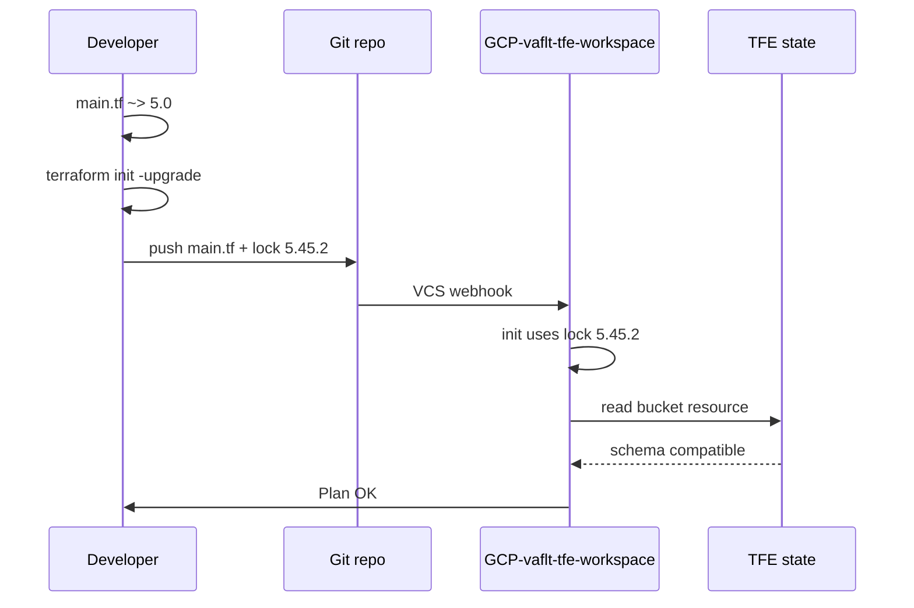
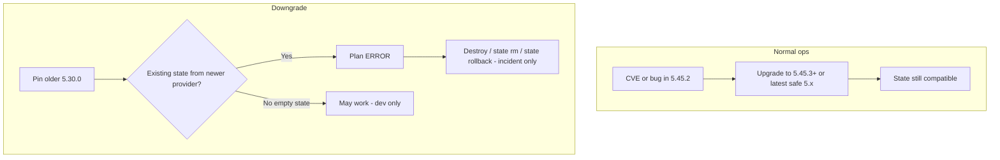
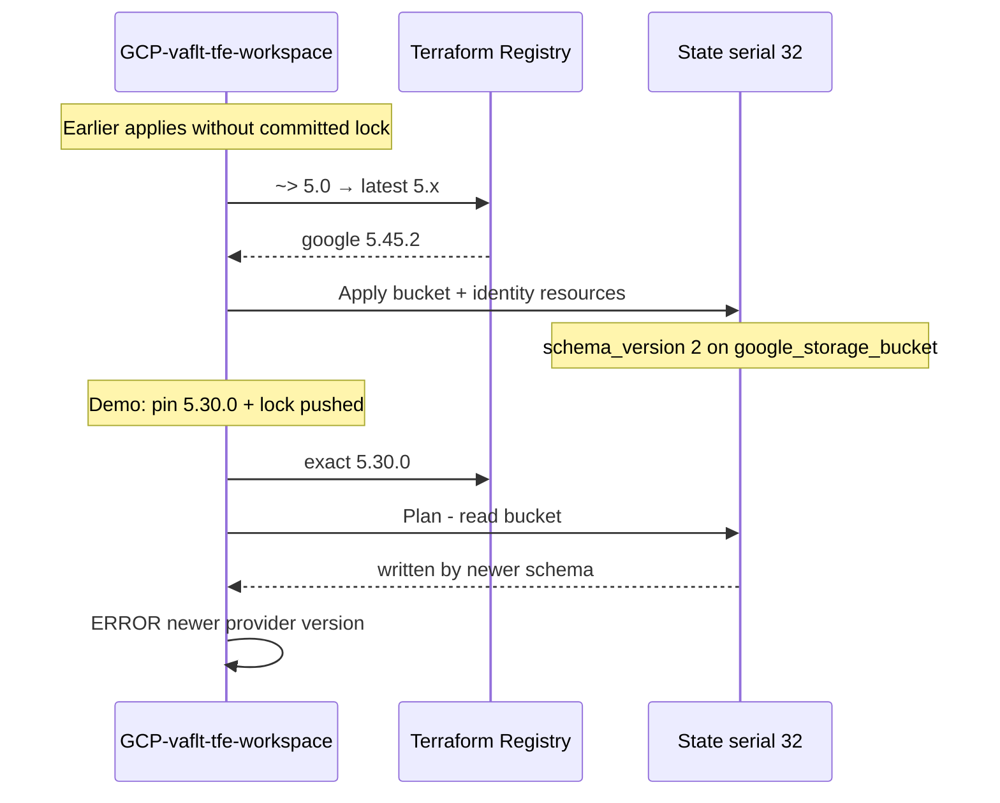
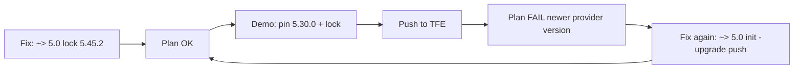

# Terraform Provider Version Error

Guide for the error **"Resource instance managed by newer provider version"** — how it happens, how to fix it, why downgrade is usually wrong, and how to reproduce it in this repo.

**Workspace:** `GCP-vaflt-tfe-workspace` (`ws-4V97YqCc8p3GH3U9`)  
**Working directory:** `tfe-workspace/envs/dev`  
**Provider:** `hashicorp/google`

### Why commit and push `.terraform.lock.hcl` (good practice)

**Yes — committing and pushing the lock file per environment root module is standard enterprise practice.**  
`main.tf` only sets a *range* (e.g. `version = "~> 5.0"`). On each `terraform init`, Terraform must pick an exact provider build (e.g. **5.45.2**). The lock records that choice and the provider checksums.

**You must push the lock** because Terraform Cloud/Enterprise loads config from **Git**, not from your laptop. If the lock is missing from the repo, TFE resolves `~> 5.0` to whatever is **latest on the registry at init time** — which can differ from your local run and from last week’s apply. State is then written with that provider’s internal schema.

**If you do not commit/push the lock:**

| What happens | Risk |
|--------------|------|
| TFE init picks **latest** matching `~> 5.0` (no lock in repo) | Applies use **5.45.2** today, **5.46.0** tomorrow — unpredictable |
| State saved with provider A; later run uses older pinned provider B | **"Resource instance managed by newer provider version"** |
| Laptop vs TFE vs CI use different provider builds | “Works on my machine”, surprise plan diffs |
| `.gitignore` excludes lock files | Same drift; this error becomes likely after the first apply |

### What happens if somebody doesn’t push the lock (step by step)

There are three common cases — all cause **version drift** because TFE only sees what is in **Git**.

**Case A — Lock never in repo (ignored or never committed)**



1. `main.tf` says `~> 5.0`; no lock in Git.
2. On every TFE run, `terraform init` asks the registry for the **newest** 5.x that matches.
3. First apply might use **5.45.2**; a later run might use **5.46.0** without any code change.
4. State reflects whichever provider actually ran — **not** what the developer had locally.

**Case B — Developer updates lock locally but doesn’t push**

1. Dev runs `terraform init -upgrade` → lock becomes **5.46.0** on laptop.
2. Dev pushes only `main.tf` (or other `.tf` files), **not** the lock.
3. TFE still has **no lock** or an **old lock** (e.g. **5.30.0**) in Git.
4. TFE init uses what’s in Git — **not** the dev’s **5.46.0**.
5. Plan on laptop succeeds; plan on TFE fails or shows unexpected diffs.

**Case C — Old lock in repo; someone removes or never upgrades it**

1. State was written when TFE had no lock → **5.45.2** applied.
2. Later someone commits lock pinned to **5.30.0** (mistake or demo).
3. TFE init uses **5.30.0** from Git.
4. Plan fails: **state from newer provider than selected**.

**Summary — if lock is not pushed:**

| Who | What they use |
|-----|----------------|
| Developer (if they ran init) | Whatever their **local** lock says |
| TFE | **Latest** matching `~> 5.0` if no lock in Git, **or** whatever **old** lock is still in Git |
| Result | State and runs **drift**; provider version errors and surprise plan changes |

### No lock (or lock not pushed) → floating latest — unpredictable, not production-safe

**Correct:** if you do not use a lock in Git, or you generate one locally but never push it, TFE tends to use whatever **updated** 5.x matches `~> 5.0` **at init time**. That is **not a good approach** for production — it is **unpredictable**.

**Without a lock in Git:**

| Step | What happens |
|------|----------------|
| `main.tf` | `version = "~> 5.0"` is only a **range** (>= 5.0, < 6.0), not an exact build |
| Each TFE `terraform init` | Registry returns the **newest** 5.x that matches **right now** |
| This week | e.g. **5.45.2** |
| After HashiCorp publishes **5.46.0** | Next init may pick **5.46.0** — **no Terraform code change** |

It is not guaranteed to change on **every** run (only when a newer 5.x exists on the registry), but you are always **floating** on latest — never pinned.

**Why that is a bad approach:**

| Problem | Effect |
|---------|--------|
| **Unpredictable** | Same branch can run different provider builds on different days |
| **Environment drift** | Laptop, TFE, and CI may each use a different build |
| **State / version errors** | Apply with **5.46** writes state; later pin **5.30** in Git → *"managed by newer provider version"* |
| **Surprise plan diffs** | New provider patch can change refresh/plan behavior without a `.tf` change |
| **Hard to debug** | “It worked last week” with nothing obvious in Git history |

**Good approach (predictable):**

```text
main.tf (~> 5.0)  +  .terraform.lock.hcl (exact 5.45.2)  →  commit & push both  →  TFE + team use 5.45.2
```

Upgrade **deliberately:** `terraform init -upgrade` → test in dev → commit **new** lock → push. Do not rely on the registry’s latest 5.x on every pipeline run.

**Fix:** always `git add` and push `tfe-workspace/envs/dev/.terraform.lock.hcl` with any provider-related change. TFE does not read your laptop’s lock file.

**Good practice:** commit `tfe-workspace/envs/dev/.terraform.lock.hcl` alongside `main.tf`, push to the VCS branch TFE tracks, and bump the lock deliberately (`terraform init -upgrade`) after testing — never rely on floating latest in production pipelines. In this repo, root `.gitignore` ignores all locks **except** `tfe-workspace/envs/dev/.terraform.lock.hcl` so bootstrap locks stay local while the workload dev root stays pinned.

### If someone updates the provider version → push the upgraded lock too

Whenever the provider constraint changes in `main.tf` (e.g. `~> 5.0`, `>= 5.44.0`, or exact `"5.45.3"`), regenerate the lock and **commit both files together**:

```bash
cd tfe-workspace/envs/dev
terraform init -upgrade -backend=false

git add main.tf .terraform.lock.hcl
git commit -m "Bump hashicorp/google provider lock"
git push
```

TFE reads from **Git**, not your laptop. Pushing `main.tf` without the matching lock means TFE may still use an old lock from the repo or resolve a different build than you tested locally — same drift risk as having no lock at all.

**Rule:** change version → `init -upgrade` → push **main.tf + lock** as one change.

### Upgrade works; downgrade usually does not

Provider moves relative to **existing state**:

| Direction | Example | With existing state | Typical result |
|-----------|---------|---------------------|----------------|
| **Upgrade** | 5.30 → 5.45.2 | State from **older** provider | **Works** — newer provider reads older state |
| **Downgrade** | 5.45.2 → 5.30 | State from **newer** provider | **Fails** — *"Resource instance managed by newer provider version"* |



- **Normal ops:** only move **up** (or stay pinned via lock).
- **Downgrade:** only for empty state, demos, or incidents (destroy / migrate / state rollback) — not “change version and push.”

**One line:** update version → `init -upgrade` → push **main.tf + lock**; upgrade over state is fine, downgrade over existing state is blocked by design.

---

## The error

```text
Error: Resource instance managed by newer provider version

The current state of module.workload.module.workload_resources.module.storage_buckets.google_storage_bucket.buckets["workload"]
was created by a newer provider version than is currently selected.
Upgrade the google provider to work with this state.
```

---

## What Terraform is comparing

This is **not** a mismatch between `main.tf` and `.terraform.lock.hcl`. Those should always match.

Terraform compares:

| Side A | Side B |
|--------|--------|
| **Provider running now** (from lock + init) | **Provider that last wrote state** (embedded in TFE state for each resource) |



State does **not** store the Google provider semver (e.g. `5.45.2`) as a field. It stores an internal **schema version** per resource instance. An older provider cannot decode state written by a newer one.

---

## How this error is generated (common scenarios)



### Scenario 1 — No lock file (most common)

1. `main.tf` has `version = "~> 5.0"`.
2. No committed `.terraform.lock.hcl`.
3. TFE `terraform init` picks **latest** 5.x (e.g. **5.45.2**).
4. Apply creates resources; state is saved with that provider’s schema.
5. Someone commits a lock pinned to an **older** version, or pins an exact old version in `main.tf`.
6. Next plan uses **5.30.0** against state from **5.45.2** → **error**.

### Scenario 2 — Lock and main.tf agree, but both are too old

1. State was written with **5.45.2** (no lock or latest resolve).
2. Both `main.tf` and lock pin **5.30.0** (intentional demo or mistake).
3. Plan fails — lock and main match, but **state is newer**.

### Scenario 3 — Config too old for HCL (different error)

1. Pin **5.10.0** (before `soft_delete_policy` existed).
2. Fails earlier with **Unsupported block type** on `soft_delete_policy` in `gcs-buckets` module.
3. You never reach the “newer provider version” error until config is valid (use **≥ 5.15** for demo downgrade).

### Scenario 4 — Bad newer release (rare, incident)

1. Team applies with **5.45.2**; state updated.
2. **5.45.2** has a regression; someone tries **5.44.0**.
3. Often blocked by the same error — downgrade over existing state is hard by design.

---

## The fix (recommended)

**Upgrade / align the provider with state** — do not destroy production buckets for this.

### Steps

1. Set constraint in `tfe-workspace/envs/dev/main.tf`:

   ```hcl
   version = "~> 5.0"
   ```

   `~> 5.0` means `>= 5.0, < 6.0`. `terraform init -upgrade` resolves to the latest matching 5.x; the lock pins the exact version for reproducible runs.

2. Regenerate the lock locally:

   ```bash
   cd tfe-workspace/envs/dev
   terraform init -upgrade -backend=false
   ```

   `-backend=false` skips remote backend setup locally; the lock file still updates.

3. Commit and push **both** files:

   ```bash
   git add tfe-workspace/envs/dev/main.tf tfe-workspace/envs/dev/.terraform.lock.hcl
   git commit -m "Fix: align Google provider lock with state"
   git push origin feature/new-bootstrap
   ```

4. Run plan on TFE — should succeed (e.g. lock at **5.45.2** matches state writer).



### Prevention (enterprise practice)

| Practice | Why |
|----------|-----|
| Commit `.terraform.lock.hcl` per root module | Same provider on laptop, CI, and TFE |
| Test provider bumps in dev first | Catch regressions before prod |
| Use Renovate/Dependabot on lock files | Controlled forward upgrades |
| Do **not** ignore lock in `.gitignore` for workload envs | This repo allows only `tfe-workspace/envs/dev/.terraform.lock.hcl` |

---

## Downgrade is not recommended



### Why teams avoid downgrade

| Reason | Detail |
|--------|--------|
| **State is forward-only** | Older provider cannot read newer state schema |
| **Security** | Older releases usually have **more** known CVEs, not fewer |
| **Data** | Prod buckets use `force_destroy = false`; destroy is blocked if objects exist |
| **Fix forward** | Patch releases (5.45.2 → 5.45.3) keep state compatible |

### When downgrade might be considered (rare)

| Situation | Approach |
|-----------|----------|
| **Empty state** (new workspace, after full destroy) | Pin older version + init — works |
| **Demo / learning** | Pin old version to trigger error — no migration needed |
| **Bad release, no patch yet, dev bucket empty** | Targeted destroy → downgrade → recreate |
| **Prod with data** | Fix forward, or TFE state rollback + incident review — not casual destroy |

True downgrade with existing state often requires:

1. Fix provider temporarily so Terraform can run.
2. Targeted destroy of affected resources (only if safe and empty), **or** `terraform state rm` + import, **or** TFE state version rollback.
3. Pin older provider, init, apply to recreate.

This is **incident playbook**, not daily operations.

---

## Security note (upgrade, not downgrade)

If a provider version has a vulnerability:

```text
Wrong: 5.45.2 has CVE → downgrade to 5.30.0
Right: 5.45.2 has CVE → upgrade to patched 5.45.3+ or latest safe 5.x
```

Commit the new lock after testing in dev.

---

## This project: why the error happened

### Timeline



### Root cause

1. **State serial 32** had resources applied with **hashicorp/google ~5.45.x** (latest match for `~> 5.0` when no lock was in repo).
2. Demo pinned **`5.30.0`** in both `main.tf` and `.terraform.lock.hcl`.
3. **5.30.0** supports `soft_delete_policy` (≥ 5.15) but is **older** than the provider that wrote state.
4. Terraform failed on refresh of  
   `module.workload.module.workload_resources.module.storage_buckets.google_storage_bucket.buckets["workload"]`.

### First attempt (5.10.0)

Pinning **5.10.0** failed earlier with **Unsupported block type** on `soft_delete_policy` in `tfe-workspace/modules/gcs-buckets/main.tf` — config validation before state read.

### How it was fixed in this repo

1. Reverted `main.tf` to `version = "~> 5.0"`.
2. Ran `terraform init -upgrade -backend=false` → lock **5.45.2**.
3. Pushed `main.tf` + `tfe-workspace/envs/dev/.terraform.lock.hcl`.
4. TFE plan succeeds — current provider matches state writer.

**Do not modify `terraform-bootstrap/` for this workflow.** Only `tfe-workspace/envs/dev` lock is tracked (see root `.gitignore`).

---

## This project: reproduce the error (demo)

### Prerequisites

- TFE workspace **`GCP-vaflt-tfe-workspace`** on branch **`feature/new-bootstrap`**.
- State contains the workload bucket (serial **32** or later with bucket present).
- Fix applied first (`~> 5.0` + lock **5.45.2**) so you know plan works before demo.

### Reproduce

1. Pin an **exact** older version in `tfe-workspace/envs/dev/main.tf`:

   ```hcl
   version = "5.30.0"
   ```

   Use **≥ 5.15** (for `soft_delete_policy`) and **< 5.45.2** (state writer).

2. Regenerate lock:

   ```bash
   cd tfe-workspace/envs/dev
   terraform init -upgrade -backend=false
   ```

3. Push both files (not `terraform-bootstrap/`):

   ```bash
   git add tfe-workspace/envs/dev/main.tf tfe-workspace/envs/dev/.terraform.lock.hcl
   git commit -m "Demo: pin Google provider 5.30.0 to reproduce state version error"
   git push origin feature/new-bootstrap
   ```

4. Start plan on TFE → expect **Resource instance managed by newer provider version**.



### Fix after demo

Same as [The fix](#the-fix-recommended): `~> 5.0` → `init -upgrade` → commit lock → push.

---

## Inspect state (optional)

State JSON does not include Google provider semver. Useful fields:

| Field | Example (this workspace) |
|-------|---------------------------|
| `terraform_version` | `1.15.7` |
| `serial` | `32` |
| Bucket instance `schema_version` | `2` |
| Bucket name | `bucket-test8-bootstrap-prj-501802-tfe-dev-workload-1` |

Pull latest state via TFE API:

```bash
API="https://app.terraform.io/api/v2"
WS="ws-4V97YqCc8p3GH3U9"

curl -sS --header "Authorization: Bearer $TFE_TOKEN" \
  "$API/workspaces/$WS/current-state-version" | jq '.data.attributes | {serial, terraform_version: ."terraform-version"}'

DOWNLOAD=$(curl -sS --header "Authorization: Bearer $TFE_TOKEN" \
  "$API/workspaces/$WS/current-state-version" \
  | jq -r '.data.attributes["hosted-state-download-url"]')

curl -sSL --header "Authorization: Bearer $TFE_TOKEN" "$DOWNLOAD" -o /tmp/tfe-state.json
```

Provider version that **wrote** state: check **TFE run → Initialization** on the last successful apply.

---

## Quick reference

| Goal | `main.tf` | Command | Push | Result |
|------|-----------|---------|------|--------|
| **Fix / normal** | `~> 5.0` | `terraform init -upgrade -backend=false` | main + lock | Plan OK |
| **Demo error** | `"5.30.0"` | `init -upgrade` (with exact pin) | main + lock | Plan fails (expected) |
| **Real downgrade** | `"5.44.0"` etc. | After destroy/migrate only | main + lock | Incident-only |

| Error | Cause |
|-------|--------|
| **Unsupported block type** | Provider too old for HCL (`soft_delete_policy` on 5.10) |
| **Newer provider version** | Provider too old for **state** (5.30 vs state from 5.45) |

---

## Related files in this repo

| Path | Role |
|------|------|
| `tfe-workspace/envs/dev/main.tf` | Provider constraint |
| `tfe-workspace/envs/dev/.terraform.lock.hcl` | Exact provider pin for TFE |
| `tfe-workspace/modules/gcs-buckets/main.tf` | Bucket with `soft_delete_policy` |
| `.gitignore` | Ignores all locks except `tfe-workspace/envs/dev/.terraform.lock.hcl` |
