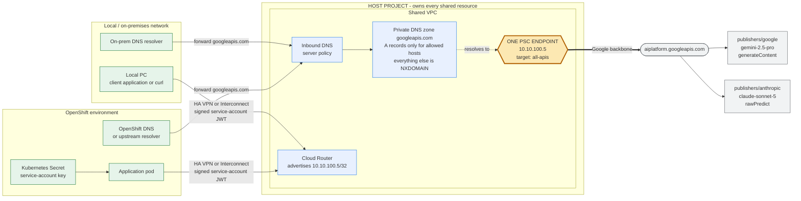
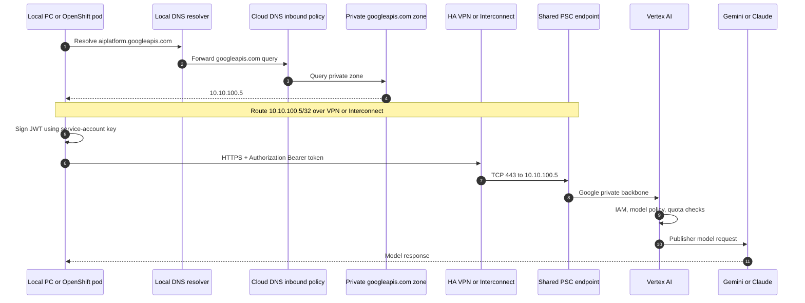
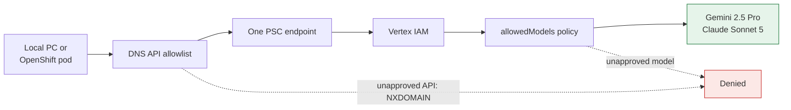
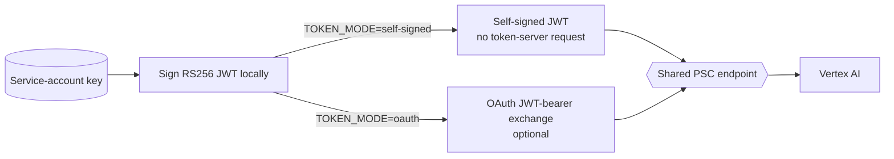

# Vertex AI through one Shared VPC PSC endpoint

This runbook provisions one Private Service Connect (PSC) endpoint in a Shared
VPC host project. Local/on-prem applications and OpenShift pods reach Gemini 2.5
Pro and Claude Sonnet 5 privately through that one endpoint.

The supported callers are external: a local PC/on-prem application and an
OpenShift workload. There are no GCE test VMs, IAP tunnels, SSH SOCKS proxies, or
metadata-server credentials in this design.

## Architecture



## Request path



## What is shared and what stays per project

| Resource | Where it lives | Instances |
|---|---|---|
| Shared VPC and subnets | Host project | One VPC, subnets as needed |
| **PSC endpoint** | Host project | **Exactly one** |
| Private DNS zone and inbound policy | Host project | One |
| Cloud Router and hybrid connection | Host project | One routing domain |
| DNS A records / API allowlist | Host project | One per approved API hostname |
| Vertex AI API enablement | Each calling project | One per project |
| Service account and `roles/aiplatform.user` | Each calling project | One or more |
| Claude Model Garden entitlement | Each calling project | One per project |
| JWT key / Workload Identity Federation | Local/OpenShift environment | Per caller |
| Quota and billing | Calling project | Per project |

The endpoint is global. A caller in any connected network sends traffic to the
same internal endpoint IP. The `projects/CALLING_PROJECT` path segment controls
which project is billed and quota-checked.

## Why PSC for Google APIs

| Feature | What it fronts | Use for Gemini / Claude |
|---|---|---|
| PSC endpoint for Google APIs (`all-apis` or `vpc-sc`) | Google API surface including `aiplatform.googleapis.com` | **Yes** |
| PSC on a Vertex AI Endpoint resource | A model deployed to your own dedicated endpoint | No |

Gemini and Claude are publisher models called through
`aiplatform.googleapis.com`; there is no deployed Vertex endpoint to attach.

## The approved models

| Model | Publisher path | Method | Extra requirement |
|---|---|---|---|
| Gemini 2.5 Pro | `publishers/google/models/gemini-2.5-pro` | `generateContent` | Vertex AI API enabled |
| Claude Sonnet 5 | `publishers/anthropic/models/claude-sonnet-5` | `rawPredict` | Enable in Model Garden per calling project |

Gemini request:

```bash
POST https://aiplatform.googleapis.com/v1/projects/PROJECT_ID/locations/global/publishers/google/models/gemini-2.5-pro:generateContent
```

Claude request:

```bash
POST https://aiplatform.googleapis.com/v1/projects/PROJECT_ID/locations/global/publishers/anthropic/models/claude-sonnet-5:rawPredict
```

Claude is a partner model. Open Model Garden with each calling project selected,
enable Claude Sonnet 5, accept its terms, and request quota if needed.

## DNS decides whether traffic uses PSC

The endpoint is only an internal IP. Clients use it only when
`aiplatform.googleapis.com` resolves to that IP.

The module creates an authoritative private `googleapis.com.` zone. It publishes
only approved records:

| Hostname | Purpose |
|---|---|
| `aiplatform.googleapis.com` | Global Gemini and Claude calls |
| `REGION-aiplatform.googleapis.com` | Regional Vertex calls; derived from configured subnets |
| `oauth2.googleapis.com` | Optional JWT-to-OAuth exchange |
| `sts.googleapis.com` | Workload Identity Federation |

Names not in `allowed_api_hosts`, such as `storage.googleapis.com`, receive
NXDOMAIN and do not fall back to public DNS. Add a hostname to the list only when
it is approved; it still uses the same one PSC endpoint.

## Restricting calls to two models

PSC has no Vertex-only target: its target is `all-apis` or `vpc-sc`. Enforcement
is layered:

1. DNS permits only approved Google API hostnames.
2. IAM requires `roles/aiplatform.user` in the billed project.
3. `vertexai.allowedModels` optionally allows only the two approved models.
4. Claude Model Garden entitlement is required in every calling project.



Set `enforce_model_allowlist = true` to manage `vertexai.allowedModels`. This is
a project-wide policy, not only a PSC policy, and requires
`roles/orgpolicy.policyAdmin`. Add a model as
`publishers/PUBLISHER/models/MODEL:predict` to `allowed_models`.

## Shared VPC and hybrid prerequisites

Terraform creates the Shared VPC, its subnets, the one PSC endpoint, the private
DNS zone and inbound policy, client service accounts, and (optionally) the model
allowlist.

HA VPN and Interconnect are **intentionally not deployed** in this stack so a
short test stay cheap (about a couple of dollars for five days of PSC + DNS).
Private PSC access from OpenShift/local still requires VPN or Interconnect later;
until then, call Vertex with a service-account JWT over the public API path.

If you later enable private hybrid access:

1. An organization administrator enables the Shared VPC host if needed.
2. Turn on `enable_hybrid_router = true` and add HA VPN / Interconnect outside
   this low-cost stack (or in a follow-up change when you accept that cost).
3. Set `hybrid_source_ranges` to the local/OpenShift CIDRs.
4. Forward `googleapis.com` on-prem/OpenShift DNS to
   `dns_inbound_forwarder_ips`.

## Service-account JWT authentication

PSC answers **where** a request goes; a JWT identifies **who** made it.



Self-signed JWT is the default and avoids a dependency on the OAuth endpoint:

```bash
cd tfe-workspace/envs/dev
CALLING_PROJECT=PROJECT_ID \
SA_KEY_FILE=/secure/sa.json \
PSC_IP=10.10.100.5 \
./scripts/test-vertex-psc-from-external.sh
```

OAuth mode is also available:

```bash
TOKEN_MODE=oauth CALLING_PROJECT=PROJECT_ID \
SA_KEY_FILE=/secure/sa.json \
./scripts/test-vertex-psc-from-external.sh
```

OAuth mode requires `oauth2.googleapis.com` in the DNS allowlist. Self-signed
mode requires no token-server network call.

## Local PC and OpenShift deployment

For a local PC, secure the JSON key with filesystem permissions:

```bash
chmod 600 sa.json
export SA_KEY_FILE="$PWD/sa.json"
```

For OpenShift, create and mount a read-only Secret; never embed a key in an image:

```bash
oc -n APP_NAMESPACE create secret generic vertex-ai-sa \
  --from-file=sa.json=/secure/sa.json
```

Mount `/var/run/secrets/vertex/sa.json` into the application pod and set:

```bash
export SA_KEY_FILE=/var/run/secrets/vertex/sa.json
export CALLING_PROJECT=PROJECT_ID
```

Workload Identity Federation is preferred when OpenShift can federate with Google
Cloud because it eliminates long-lived JSON keys.

## Terraform configuration

```hcl
vertex_psc = {
  enabled = true

  # Keep hybrid off for a low-cost deploy. No HA VPN / Interconnect is created.
  enable_hybrid_router = false
  hybrid_source_ranges = []

  # Terraform creates these Shared VPC subnets for DNS inbound forwarders and
  # future hybrid use; they are not GCE test-VM landing zones.
  subnets = {
    primary   = { region = "us-central1", cidr = "10.10.0.0/24" }
    secondary = { region = "europe-west1", cidr = "10.10.1.0/24" }
  }
  psc_endpoint_ip = "10.10.100.5"

  allowed_api_hosts = [
    "aiplatform.googleapis.com",
    "oauth2.googleapis.com",
    "sts.googleapis.com",
  ]

  allowed_models = [
    "publishers/google/models/gemini-2.5-pro:predict",
    "publishers/anthropic/models/claude-sonnet-5:predict",
  ]
  enforce_model_allowlist = true

  service_projects = {
    application = {
      project_id       = "APPLICATION_PROJECT_ID"
      create_client_sa = true
    }
  }
}
```

`create_sa_key` is false by default because Terraform stores a generated private
key in state. Prefer an out-of-band key process or Workload Identity Federation.

After apply, collect the values the external callers need:

```bash
terraform output -json vertex_psc | jq '{
  endpoint_ip,
  subnets,
  dns_inbound_forwarder_ips,
  cloud_router_name,
  cloud_router_region,
  host_client_sa,
  allowed_api_hosts,
  allowed_models
}'
```

## Verification and troubleshooting

Before calling a model, verify DNS and routing from the real caller. Use
`dscacheutil` on macOS or `getent` on Linux/OpenShift:

```bash
# macOS
dscacheutil -q host -a name aiplatform.googleapis.com

# Linux / OpenShift
getent ahostsv4 aiplatform.googleapis.com

# expect: 10.10.100.5

nc -vz 10.10.100.5 443
```

| Symptom | Likely cause |
|---|---|
| Hostname resolves to a public IP | DNS is not forwarding `googleapis.com` to Cloud DNS |
| Hostname does not resolve | Hostname missing from `allowed_api_hosts`, or inbound DNS is unreachable |
| Connection times out | Missing VPN/Interconnect route, BGP `/32` advertisement, or firewall rule |
| `401 UNAUTHENTICATED` | Wrong JWT audience, deleted key, or clock skew; retry OAuth mode to isolate |
| `403 Permission denied` | Service account lacks `roles/aiplatform.user` in `CALLING_PROJECT` |
| Claude-only `403` | Claude is not enabled in Model Garden for that project |
| `404 model not found` | Incorrect region; use `locations/global` for the documented models |
| Key creation denied | `constraints/iam.disableServiceAccountKeyCreation` is enforced; use federation |

## References

- [Access Google APIs through PSC endpoints](https://cloud.google.com/vpc/docs/configure-private-service-connect-apis)
- [Shared VPC overview](https://cloud.google.com/vpc/docs/shared-vpc)
- [Cloud DNS inbound forwarding](https://cloud.google.com/dns/docs/policies)
- [Claude on Vertex AI](https://cloud.google.com/vertex-ai/generative-ai/docs/partner-models/use-claude)
- [Service-account OAuth and JWT flow](https://developers.google.com/identity/protocols/oauth2/service-account)
- [AIP-4111 self-signed JWT](https://google.aip.dev/auth/4111)
