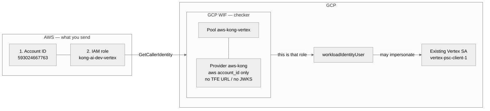
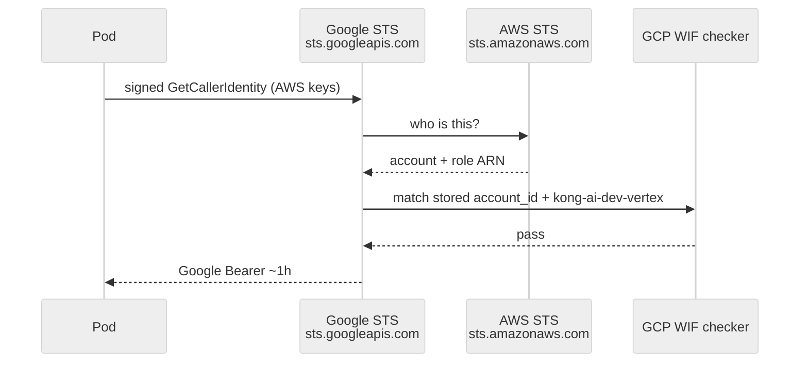

# What GCP needs from AWS (Vertex WIF)

GCP Workload Identity Federation only needs **two things** from the AWS team.
That is the IAM role the EKS pod will assume — not keys, not a Google token.

Full design: [VERTEX-KONG-AWS-IRSA-WIF.md](VERTEX-KONG-AWS-IRSA-WIF.md).

---

## Send these two

| # | Item | What it is | Example |
|---|---|---|---|
| 1 | **AWS account ID** | 12-digit account that **owns the IAM role** (same account as EKS in this setup) | `593024667763` |
| 2 | **IAM role name or ARN** | Role the Kong / app pod assumes via IRSA | `kong-ai-dev-vertex` or `arn:aws:iam::593024667763:role/kong-ai-dev-vertex` |

Role ARN always includes the account:

```text
arn:aws:iam::593024667763:role/kong-ai-dev-vertex
                 ^^^^^^^^^^^^              ^^^^^^^^^^^^^^^^^
                 1. account ID             2. role name
```

GCP WIF checks that role. It does not check cluster name, namespace, or Kubernetes ServiceAccount.

**That AWS role impersonates the existing Vertex SA.** GCP WIF is the checker box.



| | Identity |
|---|---|
| Role that impersonates | AWS `kong-ai-dev-vertex` |
| Who it becomes | GCP `vertex-psc-client-1` |
| Checker | GCP WIF provider `aws-kong` |

### Notes

- That **AWS role impersonates** the Vertex SA. It does not call Vertex as itself.
- **Vertex access** is on the SA: `vertex-psc-client-1` has `roles/aiplatform.user`.
- The AWS role has **no** Vertex permission — only `workloadIdentityUser` (may become that SA).

OIDC vs this AWS provider: [VERTEX-AWS-WIF-VS-TFE-OIDC.md](VERTEX-AWS-WIF-VS-TFE-OIDC.md).

---

## No TFE URL / JWKS from AWS

TFE **bootstrap** WIF is OIDC. GCP needs the TFE issuer URL (`https://app.terraform.io`) so it can pull JWKS and check HCP’s JWT.

This AWS path is **not** OIDC. GCP does **not** need a TFE URL and does **not** need JWKS from AWS.

```hcl
# bootstrap (TFE) — OIDC, needs issuer URL / JWKS
oidc {
  issuer_uri = "https://app.terraform.io"
}

# Kong / EKS — AWS provider, only account ID
aws {
  account_id = "593024667763"
}
```

Google checks the AWS role with **STS GetCallerIdentity**, not a JWKS URL.

| Who | Uses JWKS? | For what |
|---|---|---|
| GCP WIF ← TFE | Yes | HCP JWT |
| GCP WIF ← AWS (this stack) | **No** | Account ID + role |
| AWS IAM ← EKS pod | Yes | Cluster OIDC so the pod can assume the role |

EKS OIDC/JWKS stays **inside AWS** (IRSA). Do not send that issuer URL to GCP.

---

## How GCP verifies — two STS services

**STS** = Security Token Service. It issues **short-lived** credentials. There are **two**:

| STS | URL | Job here |
|---|---|---|
| **AWS STS** | `sts.amazonaws.com` | “Who is this AWS caller?” (`GetCallerIdentity`). Also gives the pod temp AWS keys from IRSA (`AssumeRoleWithWebIdentity`). |
| **Google STS** | `sts.googleapis.com` | After AWS answers, mint a **Google** access token (Bearer) as `vertex-psc-client-1`. |

GCP does **not** call AWS when you send the account ID. Apply only **stores** account + role on the WIF provider.

When the **pod** later wants a Google token, **Google STS does call AWS STS**:

```text
1. Pod (IRSA) already has temp AWS access key + secret
2. Library signs AWS Action=GetCallerIdentity with those keys (SigV4)
3. Pod → Google STS (sts.googleapis.com)  with that signed request
     (not a TFE JWT, not JWKS)
4. Google STS → AWS STS (sts.amazonaws.com)  “who signed this?”
5. AWS STS verifies the signature (only AWS can). Returns:
     Account = 593024667763
     Arn     = ...assumed-role/kong-ai-dev-vertex/...
6. GCP WIF matches stored account_id + role name
7. Google STS returns Google Bearer as vertex-psc-client-1
```



Account ID + role name are like a **username** (always the same). The **password** is live AWS keys + AWS STS verifying the signature. Google does not keep AWS secrets and does not use JWKS on this path.

---

## Do not send

- IAM access keys
- A Google Bearer / JWT
- `sa.json`
- TFE / `app.terraform.io` URL
- EKS OIDC issuer or JWKS URL (AWS uses that for IRSA, not GCP)

---

## Fill in and send to GCP

```text
AWS account ID:  ______________
IAM role name:   ______________
```

GCP wires those into `vertex_psc.aws_wif` and, after apply, returns the SA email plus WIF audience / provider for the pod. No secret is exchanged.
