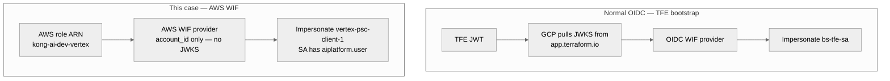

# AWS role for GCP vs TFE OIDC WIF

## What AWS creates (for GCP, that is all)

AWS creates **one IAM role** the EKS pod will assume (IRSA). Then they send GCP the **role ARN** (account ID is inside it).

```text
arn:aws:iam::593024667763:role/kong-ai-dev-vertex
```

**That is all GCP needs from AWS.** No TFE URL, no JWKS, no access keys, no Google token, no `sa.json`.

| AWS creates | Give to GCP? |
|---|---|
| IAM role `kong-ai-dev-vertex` | **Yes** — name or ARN |
| IRSA so the Kong SA can assume that role | No — stays in AWS |
| EKS cluster OIDC / JWKS | No — stays in AWS |

Handoff form: [VERTEX-AWS-WIF-REQUIREMENTS.md](VERTEX-AWS-WIF-REQUIREMENTS.md).

---

## Notes (who impersonates, who can call Vertex)

The AWS role **impersonates** the existing Vertex SA. It does **not** get Vertex permissions of its own.

| Identity | What it can do |
|---|---|
| AWS role `kong-ai-dev-vertex` | Be the pod. After WIF check, **impersonate** the Vertex SA (`workloadIdentityUser`). **No** `aiplatform.user`. |
| GCP SA `vertex-psc-client-1@bootstrap-prj-501802.iam.gserviceaccount.com` | **Has** `roles/aiplatform.user` — this is what can call Vertex. |

```text
AWS role  →  GCP WIF checks it  →  impersonates Vertex SA  →  SA already has Vertex  →  Gemini
```

---

## How this is different from normal OIDC (TFE bootstrap)

This repo already has **OIDC WIF** for Terraform Cloud. Kong / EKS uses an **AWS-type** WIF provider instead.

| | Normal OIDC (TFE bootstrap) | This case (AWS EKS → Vertex) |
|---|---|---|
| File | `terraform-bootstrap/modules/bootstrap/main.tf` | `tfe-workspace/modules/vertex-psc/aws_wif.tf` |
| Provider type | `oidc { issuer_uri = ... }` | `aws { account_id = ... }` |
| What GCP needs from the other side | TFE URL (`https://app.terraform.io`) so GCP can pull **JWKS** | **Account ID + IAM role ARN only** |
| Checker looks at | HCP JWT (`terraform_workspace_id`) | AWS `GetCallerIdentity` (role ARN) |
| Who federates | TFE run | EKS pod |
| Who they impersonate | `bs-tfe-sa` (Terraform) | `vertex-psc-client-1` (Vertex) |
| JWKS from the other team | **Yes** (via TFE issuer) | **No** |

```hcl
# Normal OIDC — TFE bootstrap
oidc {
  issuer_uri = "https://app.terraform.io"
}
attribute_condition = "assertion.terraform_workspace_id == '...'"

# This case — AWS, not OIDC
aws {
  account_id = "593024667763"
}
attribute_condition = "attribute.aws_role == 'arn:aws:iam::593024667763:role/kong-ai-dev-vertex'"
```



EKS still uses OIDC/JWKS **inside AWS** so the pod can assume `kong-ai-dev-vertex`. That JWKS is **not** given to GCP.

Related: [VERTEX-KONG-AWS-IRSA-WIF.md](VERTEX-KONG-AWS-IRSA-WIF.md) · [BOOTSTRAP-FLOW.md](BOOTSTRAP-FLOW.md)
