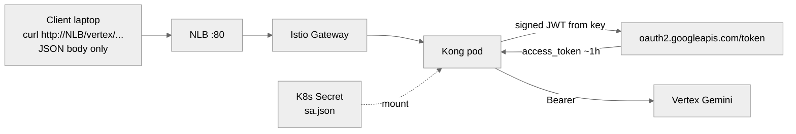

# Call Vertex Gemini from Kong — JSON key lab

Throwaway path: a GCP service-account **JSON key** in a Kubernetes Secret.
Kong **is** `vertex-psc-client-1` because it holds that private key.

**Keep this for a lab you will delete with the namespace.** Anything you keep
should use IRSA + GCP WIF instead:
[VERTEX-KONG-AWS-IRSA-WIF.md](VERTEX-KONG-AWS-IRSA-WIF.md).

This GCP org enforces `iam.disableServiceAccountKeyCreation`. A JSON key
needs an org-policy exception. The laptop proof does **not** use a key:

```bash
export CLIENT_SA=vertex-psc-client-1@bootstrap-prj-501802.iam.gserviceaccount.com
TOKEN=$(gcloud auth print-access-token --impersonate-service-account="${CLIENT_SA}")
```

PSC is **not** used from AWS. Same public Vertex URL as the laptop curl.

---

## What sits where

| Piece | Lab value |
|---|---|
| Calling project | `bootstrap-prj-501802` |
| SA in the key file | `vertex-psc-client-1@bootstrap-prj-501802.iam.gserviceaccount.com` |
| Secret | `sa.json` mounted into the Kong pod |
| Kong route | `/vertex` → `https://aiplatform.googleapis.com` |
| Client curl | JSON only — **no** `Authorization` |
| Bearer | Kong adds it after `oauth2.googleapis.com/token` |



---

## Client call (same as WIF)

You still do not send `Authorization`. Kong mints Google’s token from the key.

```bash
NLB=$(kubectl -n istio-ingress get svc istio-ingressgateway -o jsonpath='{.status.loadBalancer.ingress[0].hostname}')

curl -sS -X POST \
  "http://${NLB}/vertex/v1/projects/bootstrap-prj-501802/locations/global/publishers/google/models/gemini-2.5-pro:generateContent" \
  -H "Content-Type: application/json" \
  -d '{"contents":{"role":"user","parts":{"text":"Reply with exactly: OK"}}}'
```

Direct Vertex URL (what Kong calls after adding Bearer):

```text
POST https://aiplatform.googleapis.com/v1/projects/bootstrap-prj-501802/locations/global/publishers/google/models/gemini-2.5-pro:generateContent
Authorization: Bearer <google access_token>
```

---

## Lab steps (outline)

1. Create a key **out of band** (org policy exception). Do not commit it.
2. `kubectl -n kong-ai-gateway create secret generic vertex-ai-sa --from-file=sa.json=/secure/sa.json`
3. Helm: volume-mount that Secret into Kong. Do **not** `COPY` the key into the image.
4. Kong `/vertex` uses the key to mint a token (plugin / ADC), then proxies to
   `aiplatform.googleapis.com`.
5. Delete the key in GCP and the Secret when the lab is over.

Do not put the JSON, the access token, or TFC tokens in GitHub.

---

## vs WIF

| | This file | [VERTEX-KONG-AWS-IRSA-WIF.md](VERTEX-KONG-AWS-IRSA-WIF.md) |
|---|---|---|
| On the pod | Long-lived `sa.json` | No GCP key; IRSA only |
| If dumped | Key works until deleted in GCP | AWS creds expire; WIF must still match |
| When to use | Lab | Anything you keep |
