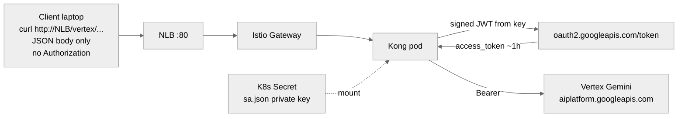
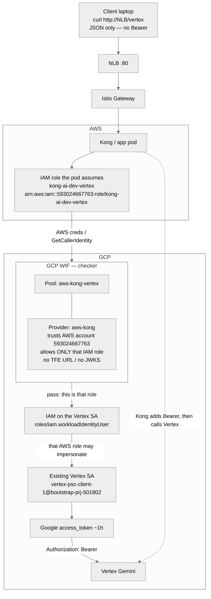
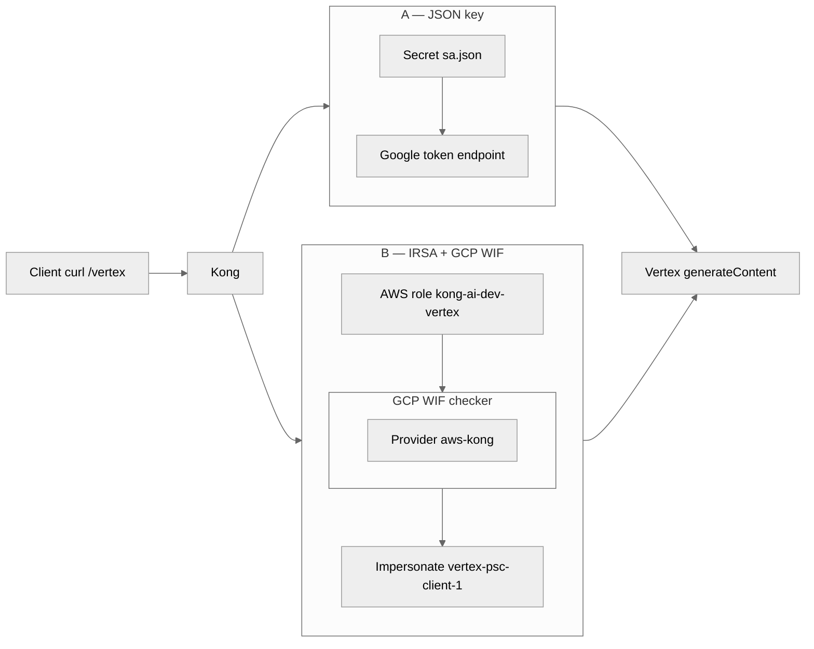

# Call Vertex Gemini from Kong on AWS (IRSA + GCP WIF)

Better approach: **no JSON key on the pod**. Kong’s Kubernetes ServiceAccount
gets an AWS IAM role (IRSA). GCP Workload Identity Federation trusts that role
and lets it impersonate
`vertex-psc-client-1@bootstrap-prj-501802.iam.gserviceaccount.com`. Kong then
calls Vertex with a short-lived Google token.

**GCP WIF is in this repo** (`vertex_psc.aws_wif` in `tfe-workspace/envs/dev`). AWS IRSA
role, Helm annotation, and Kong `/vertex` are **not** in this repo. Same public
Vertex URL as the laptop curl. PSC is not used from AWS.

What to ask AWS: [VERTEX-AWS-WIF-REQUIREMENTS.md](VERTEX-AWS-WIF-REQUIREMENTS.md) (account ID + IAM role only).

Lab (JSON key in a Secret): [VERTEX-JSON-KEY.md](VERTEX-JSON-KEY.md).

Laptop proof (impersonation as **you**, not as the pod):

```bash
export CLIENT_SA=vertex-psc-client-1@bootstrap-prj-501802.iam.gserviceaccount.com
TOKEN=$(gcloud auth print-access-token --impersonate-service-account="${CLIENT_SA}")
```

WIF is that impersonate step for the Kong pod, with **AWS as the caller**
instead of your user.

---

## Comparison: JSON key vs WIF

| | JSON key ([VERTEX-JSON-KEY.md](VERTEX-JSON-KEY.md)) | IRSA + GCP WIF (this file) |
|---|---|---|
| What sits on the pod | `sa.json` private key in a Secret | No GCP key; only AWS IRSA |
| Who the pod “is” | The SA (the file is `vertex-psc-client-1`) | An AWS IAM role, then impersonates that SA |
| Like this repo already | A long-lived access key | HCP JWT → assume `hcp-terraform-run` |
| If the pod/node is dumped | Key works until you delete it in GCP | AWS creds expire; GCP still requires WIF match |
| Rotate | New JSON, replace Secret, restart Kong | No key to rotate; tighten IAM / WIF condition |
| Terraform | Optional (Secret is CLI) | Yes — IAM role + IRSA; GCP WIF binding |
| Helm | Volume mount Secret | Annotate ServiceAccount with role ARN |
| Kong route `/vertex` | Same | Same |
| Token on NLB curl | Kong adds Bearer | Kong adds Bearer |
| `gcloud` in the image | No | No |
| PSC from AWS | No | No |
| When to use | Lab, throwaway key | Anything you keep |

Same Vertex call either way. Only how Kong mints the Bearer changes.

```text
POST https://aiplatform.googleapis.com/v1/projects/bootstrap-prj-501802/locations/global/publishers/google/models/gemini-2.5-pro:generateContent
Authorization: Bearer <google access_token>
```

**Client = you** (laptop, curl). Not Kong, not GCP. You hit the NLB path
`/vertex` and send JSON. You do **not** send `Authorization`. Kong adds Google’s
Bearer after it gets a token.

Arrow labels in the diagrams:

| Label | Meaning |
|---|---|
| mount | Kubernetes puts `sa.json` into the Kong pod as a file |
| signed JWT from key | Kong uses that private key to prove “I am this GCP SA” |
| access_token ~1h | Google replies with a short-lived token |
| Bearer | Kong puts `Authorization: Bearer <that token>` on the call to Vertex (not on your curl) |

---

## Diagram A — JSON key (lab)

Long-lived GCP private key in a Secret. Kong **is** the SA. Same idea as an AWS
access key in a file.



---

## Diagram B — IRSA + GCP WIF (this file)

Same as A until the Kong pod. After that, Kong has **no** `sa.json`. It must
still get a Google token before it can call Vertex.

Numbered steps after the request hits Kong:

1. The pod already has an AWS identity: K8s ServiceAccount `kong-ai-gateway` is
   annotated with an IAM role (IRSA). Same idea as HCP JWT → `hcp-terraform-run`.
2. AWS STS: EKS OIDC + that role → short-lived AWS creds on the pod.
3. Kong shows those AWS creds to GCP WIF (“this is AWS account `593024667763`,
   role `kong-ai-dev-vertex`”).
4. GCP allows that role to impersonate `vertex-psc-client-1` (your Vertex SA).
5. Google returns an `access_token` (~1 hour) to Kong.
6. Kong calls Vertex with `Authorization: Bearer <that token>`. You never see this.

Your curl is still only JSON. No Bearer from you.

**Who impersonates whom:** AWS IAM role `kong-ai-dev-vertex` (the pod) impersonates
GCP SA `vertex-psc-client-1`. GCP WIF is the checker box in the middle.



| Box | What it is |
|---|---|
| AWS IAM role `kong-ai-dev-vertex` | Who the pod **is**. This is the role that impersonates. |
| **GCP WIF** (pool + provider) | Checker: is this that AWS account + that role? |
| `workloadIdentityUser` | Permission: that AWS role may become the Vertex SA |
| `vertex-psc-client-1` | Existing GCP SA that can call Gemini. Not a new SA. |

---

## Side by side — only the token mint differs

Client, NLB, Istio, Kong route `/vertex`, and Vertex are the same. The middle
box is what changes.



Bootstrap OIDC is the same shape as the **AWS half of B**: HCP JWT → OIDC
provider → `hcp-terraform-run`. Here the JWT is the pod SA, the role is
`kong-ai-dev-vertex`, then GCP WIF is a **second hop** AWS does not have in
bootstrap.

---

## Why WIF is better

- No long-lived GCP private key in etcd or on the node.
- Same SA you already use for Vertex (`roles/aiplatform.user`). No second Google
  identity for the app.
- Same security story as HCP: GitHub has no AWS keys; HCP assumes a role. Kong
  should not carry a GCP key.
- Stolen role creds still have to look like that EKS ServiceAccount in account
  `593024667763`. Stolen `sa.json` works from any laptop until the key is deleted.
- JSON is still fine for a one-cluster lab you will delete with the namespace.

HCP never puts an AWS key in Terraform Cloud. Kong should not put a GCP key in
the cluster if WIF is available.

---

## What to build

### AWS (Terraform workloads, not Docker)

HCP OIDC in `bootstrap/aws_oidc.tf` is **not** this. That trusts Terraform
Cloud. This trusts the **EKS cluster** so the Kong pod can assume a role.

**Already there**

| Piece | Yours |
|---|---|
| Account | `593024667763` |
| Cluster | `kong-ai-dev` (`us-east-2`) |
| Namespace | `kong-ai-gateway` |
| ServiceAccount | `kong-ai-gateway` (Helm already creates it, no `role-arn` yet) |
| HCP OIDC + role `hcp-terraform-run` | Terraform only — **leave it** |

**AWS must build** (same shape as `aws_oidc.tf`, different issuer):

| # | What it is | Like in this repo |
|---|---|---|
| 1 | EKS IAM OIDC provider — AWS trusts this cluster’s SA tokens | `aws_iam_openid_connect_provider.tfc` — but issuer is the **cluster**, not `app.terraform.io` |
| 2 | IAM role e.g. `kong-ai-dev-vertex` — what the Kong pod becomes in AWS | `aws_iam_role.tfc_run` (`hcp-terraform-run`) |
| 3 | Trust policy — only `system:serviceaccount:kong-ai-gateway:kong-ai-gateway` may `AssumeRoleWithWebIdentity` | Trust Condition `workspace:…:run_phase:*` on `hcp-terraform-run` |
| 4 | Helm annotation on the existing SA | How the pod knows which role to assume. Restart Kong after this. No Secret mount. |

```yaml
eks.amazonaws.com/role-arn: arn:aws:iam::593024667763:role/kong-ai-dev-vertex
```

The role does **not** need Vertex permissions. Vertex is on GCP. This role only
has to be assumable by that SA so GCP WIF can see it.

**Do not build on AWS for this path**

- IAM user access keys for Kong
- JSON key Secret
- A second Kubernetes ServiceAccount
- Changes to HCP OIDC / `hcp-terraform-run`

GCP still builds the WIF pool + `workloadIdentityUser`. Helm/Kong still add
`/vertex`.

### GCP

You do **not** create a new Vertex SA or a JSON key. Laptop curl already proved
this SA can call Gemini.

**Already there**

| Piece | Yours |
|---|---|
| Project | `bootstrap-prj-501802` |
| Service account | `vertex-psc-client-1@bootstrap-prj-501802.iam.gserviceaccount.com` |
| Vertex permission | `roles/aiplatform.user` on that project |
| Model | `gemini-2.5-pro` on public `aiplatform.googleapis.com` |

**GCP must build** (this is the bootstrap OIDC equivalent on Google):

| # | What it is | Like in this repo |
|---|---|---|
| 1 | Workload Identity pool — a folder that says “external identities may federate here” | Empty until you add a provider |
| 2 | Workload Identity provider type **AWS** — GCP trusts AWS account `593024667763` | `google_iam_workload_identity_pool_provider.tfe_provider` (HCP → GCP). Here it is **AWS → GCP** |
| 3 | Attribute condition — only IAM role `kong-ai-dev-vertex` (not every role in the account) | Trust Condition on TFE workspace ID in `terraform-bootstrap/modules/bootstrap/main.tf` |
| 4 | IAM on the **existing** SA — grant `roles/iam.workloadIdentityUser` to that WIF principal | “This AWS role may impersonate `vertex-psc-client-1`” — same as your `gcloud --impersonate-service-account`, but the caller is the AWS role, not you |

WIF principal looks like:

```text
principalSet://iam.googleapis.com/projects/PROJECT_NUMBER/locations/global/workloadIdentityPools/POOL_ID/attribute.aws_role/arn:aws:iam::593024667763:role/kong-ai-dev-vertex
```

That binding is the **only** new permission on `vertex-psc-client-1`. Do not
create a second SA for Kong.

**In this repo (dev):** `tfe-workspace/envs/dev/main.tf` → `vertex_psc.aws_wif`,
implemented in `tfe-workspace/modules/vertex-psc/aws_wif.tf`.

```hcl
aws_wif = {
  enabled        = true
  aws_account_id = "593024667763"
  aws_role_name  = "kong-ai-dev-vertex"
}
```

TFE bootstrap already uses the same IAM role on a different principal (HCP
workspace ID, not an AWS role):

```81:86:terraform-bootstrap/modules/bootstrap/main.tf
resource "google_service_account_iam_member" "tfe_oidc_impersonation" {
  for_each = toset(local.trusted_tfe_workspace_ids)

  service_account_id = google_service_account.bootstrap.name
  role               = "roles/iam.workloadIdentityUser"
  member             = "principalSet://iam.googleapis.com/projects/${data.google_project.current.number}/locations/global/workloadIdentityPools/${google_iam_workload_identity_pool.tfe_pool.workload_identity_pool_id}/attribute.terraform_workspace_id/${each.value}"
```

**Do not build on GCP for this path**

- JSON key
- Private Service Connect from AWS
- Extra Vertex model enablement if the laptop curl already works
- `gcloud` in the Kong image

AWS still builds the EKS OIDC + IAM role. Helm annotates the Kong
ServiceAccount. GCP only trusts that role and lets it impersonate the SA you
already have.

### Kong (Helm + image)

**Already there**

| Piece | Yours |
|---|---|
| Image | `uttamgiri32/kong-ai-gateway` |
| Chart | `aws/helm/kong-ai-gateway` |
| ServiceAccount | `kong-ai-gateway` (no IRSA annotation yet) |
| `kong.yml` | httpbin only — no `/vertex` |

**Kong / Helm must build**

| # | What it is |
|---|---|
| 1 | Service + route `/vertex` — proxy to `https://aiplatform.googleapis.com` (`strip_path: true`), or Enterprise `ai-proxy` |
| 2 | Token from IRSA + WIF — ADC / plugin / `ai-proxy`, **not** `sa.json` |
| 3 | Helm SA annotation `eks.amazonaws.com/role-arn` (can ship without a new image) |
| 4 | Docker publish — only if `kong.yml` / plugin changed → Argo |

**Do not build in Kong**

- `gcloud` in the Dockerfile
- JSON key `COPY` or Secret mount (that is the lab file)
- PSC, ALB, or a second NLB for Vertex

---

## Call path (unchanged for the client)

```text
curl http://<NLB>/vertex/v1/projects/bootstrap-prj-501802/locations/global/publishers/google/models/gemini-2.5-pro:generateContent
  → Istio :80
  → Kong :8000
  → Kong mints Google token via WIF
  → aiplatform.googleapis.com  Bearer …
```

You do **not** pass `Authorization`. You do **not** run `gcloud` on that curl.

```bash
NLB=$(kubectl -n istio-ingress get svc istio-ingressgateway -o jsonpath='{.status.loadBalancer.ingress[0].hostname}')

curl -sS -X POST \
  "http://${NLB}/vertex/v1/projects/bootstrap-prj-501802/locations/global/publishers/google/models/gemini-2.5-pro:generateContent" \
  -H "Content-Type: application/json" \
  -d '{"contents":{"role":"user","parts":{"text":"Reply with exactly: OK"}}}'
```

Istio Gateway/VS only reach Kong. PeerAuthentication / DestinationRule are
in-mesh (Envoy → Kong), not Vertex.

### Egress

Same as JSON: the pod must reach `aiplatform.googleapis.com` and Google’s
STS/token endpoints. If Istio outbound is `REGISTRY_ONLY`, add ServiceEntries.
PSC / private Google APIs stay in GCP. See
[VERTEX-GEMINI-CALL.md](VERTEX-GEMINI-CALL.md) for the public vs PSC URL.

---

## Checklist

| Done | Item |
|---|---|
| GCP | SA can call Vertex (laptop impersonation curl) |
| GCP | WIF AWS provider + `workloadIdentityUser` on that SA — Terraform `vertex_psc.aws_wif` |
| AWS | EKS OIDC + IAM role + IRSA trust for `kong-ai-gateway` SA |
| Helm | ServiceAccount annotation `eks.amazonaws.com/role-arn` |
| Kong | `/vertex` (or `ai-proxy`) using WIF/ADC, not `sa.json` |
| Image | Docker publish if `kong.yml` / plugin changed |
| Test | `curl http://<NLB>/vertex/...` with **no** Bearer |

After the TFE apply, read:

```bash
terraform output -json vertex_aws_wif
```

Use `audience`, `principal`, `service_account_email`, and `credential_config` (or
`create_cred_config_command`) on the Kong pod. The AWS role named in
`aws_role_arn` must already exist and be assumed via IRSA.

---

## Mapping to identities you already use

| GCP | AWS in this story |
|---|---|
| Impersonate SA `vertex-psc-client-1` | Assume role `hcp-terraform-run` (HCP) or `kong-ai-dev-vertex` (Kong) |
| WIF pool + provider | IAM OIDC provider + role trust Condition |
| `roles/iam.workloadIdentityUser` | Trust policy `sts:AssumeRoleWithWebIdentity` |
| JSON key | IAM user access key — avoid for workloads |

Related:

- What AWS must send: [VERTEX-AWS-WIF-REQUIREMENTS.md](VERTEX-AWS-WIF-REQUIREMENTS.md)
- AWS role ARN is all GCP needs; vs TFE OIDC: [VERTEX-AWS-WIF-VS-TFE-OIDC.md](VERTEX-AWS-WIF-VS-TFE-OIDC.md)
- Laptop Vertex curl: [TEST-VERTEX.md](TEST-VERTEX.md)
- JSON-key lab: [VERTEX-JSON-KEY.md](VERTEX-JSON-KEY.md)
- AssumeRole vs impersonation: [AWS-ASSUME-VS-GCP-IMPERSONATE.md](AWS-ASSUME-VS-GCP-IMPERSONATE.md)
- TFE WIF (HCP → GCP): [BOOTSTRAP-FLOW.md](BOOTSTRAP-FLOW.md)
